# Streezy: Free Streaming Studio for Twitch, YouTube, Kick and TikTok (Windows)

**Streezy** is a free live streaming app for Windows, built on the same engine as OBS Studio. It
streams to **Twitch, YouTube, Kick, TikTok, Facebook and X at the same time**, in horizontal and
vertical at once. It's set up in two minutes, with no watermark, no subscription and no account.

**Go live everywhere. Free.**

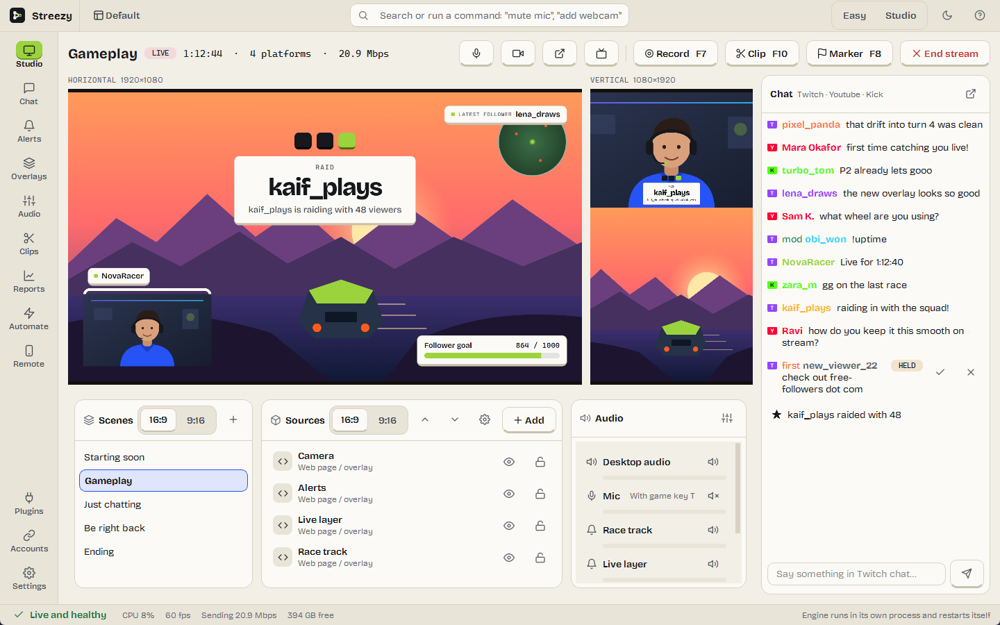

---

## Key features

| | |
|---|---|
| 📡 **Go live everywhere** | Stream to Twitch, YouTube, Kick, TikTok, Facebook, X, YouTube Shorts and any RTMP, SRT or WHIP server at once. Each platform gets the right size and bitrate, and Streezy lowers the least important ones if your upload can't carry everything. |
| 📱 **Horizontal and vertical together** | A second 9:16 canvas with its own layouts for Shorts, TikTok and Reels, streamed alongside your normal one. |
| ⚡ **Two-minute setup** | The setup checks your PC and internet, suggests a quality, and builds your scenes: Starting soon, your main scene, Be right back and Ending, with overlays and alerts. |
| 🎙️ **Your mic, your call** | Always on, push to talk, off stream, or **only when you press your game's own voice key**. Talk to friends on Discord without viewers hearing, and capture just your game so calls and music stay off stream. |
| 🎨 **Overlays** | Five built-in looks that follow your name and colour. Import **any folder of HTML overlays**, including kits made for OBS. Their control panels open in Streezy, and the event bridge sends them your follows, subs, raids and tips. |
| 💬 **Chat and alerts** | Twitch, YouTube and Kick chat in one list, with no sign-in needed to read it. Alerts for follows, subs, gifts, raids, bits, Super Chats, members and tips. Includes a chat bot, link holding and blocked words. |
| ✂️ **Clips and recordings** | One key saves the last moments as a clip. Recordings are crash-safe MP4 with separate audio tracks for editing. |
| 📊 **Stream reports** | After every stream: dropped frames, chat, new followers, the bitrate each platform received, and plain-language advice. |
| 🕹️ **Remote control** | A phone remote over Wi-Fi (scan a QR code, type a PIN). Stream Deck, Touch Portal, Streamer.bot and other OBS tools work too: Streezy speaks the OBS remote protocol. |
| 🤖 **Automate** | Switch scenes when a game comes to the front, show Be right back when you step away, and open on Starting soon. |
| 🧩 **OBS compatible** | Import your OBS scene collections, and use OBS source and filter plugins. |
| 🛡️ **Hard to break** | The video engine runs in its own process. If a plugin or capture crashes, it restarts in seconds and your stream reconnects. The window never closes on you. |
| ⌨️ **Ctrl K** | Type what you want ("mute mic", "scene brb", "add webcam") and press Enter. |

---

## Screenshots

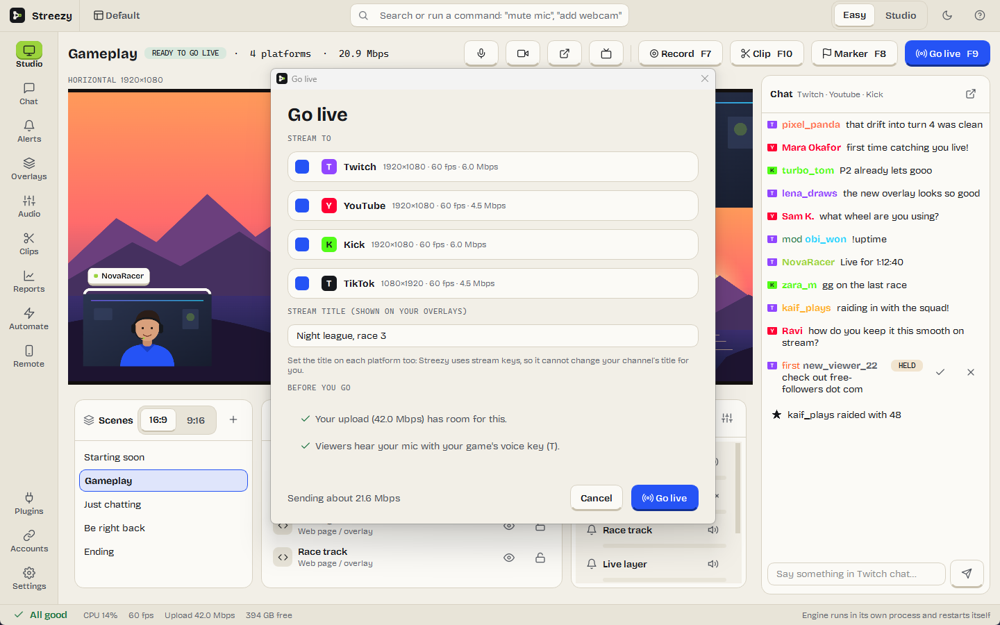 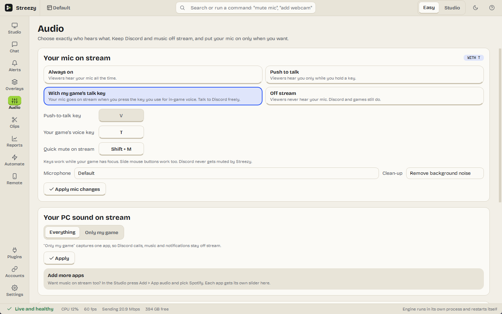

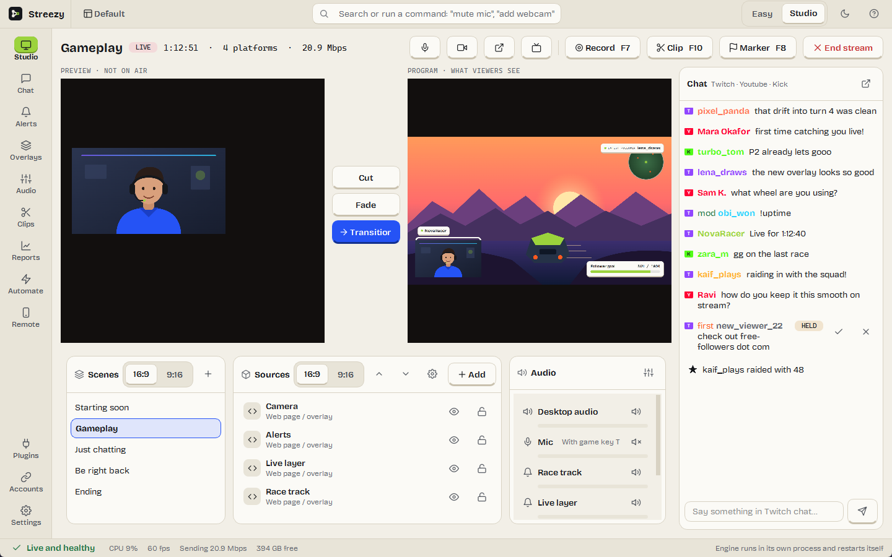 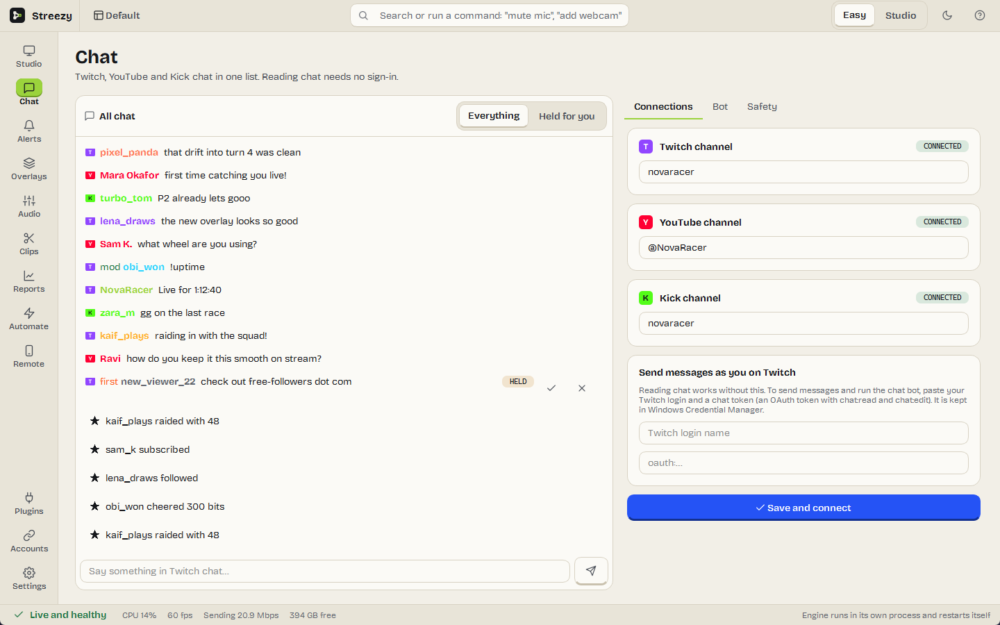

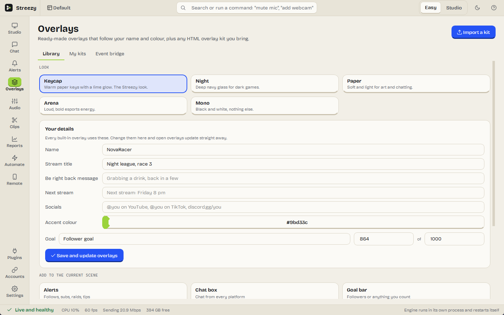 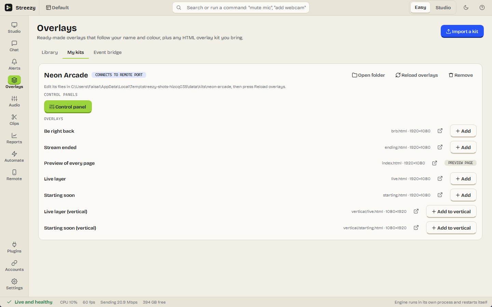

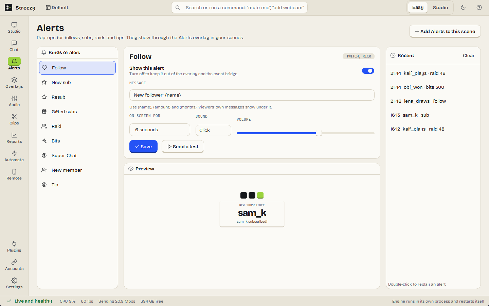 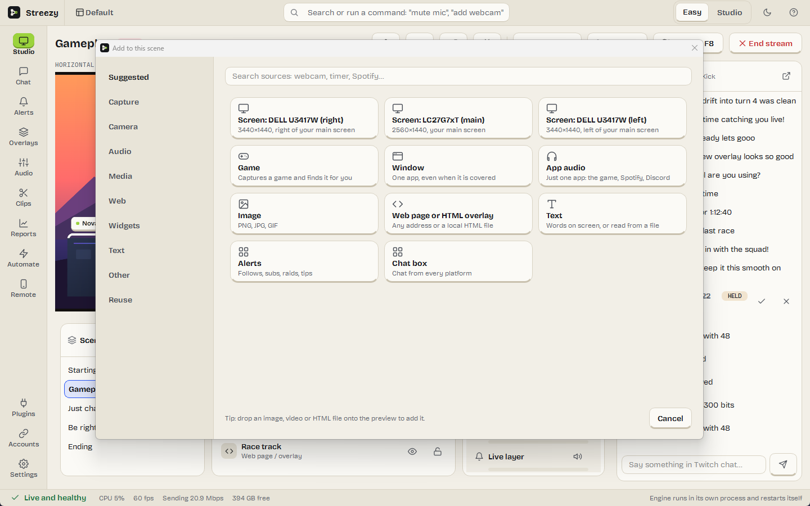

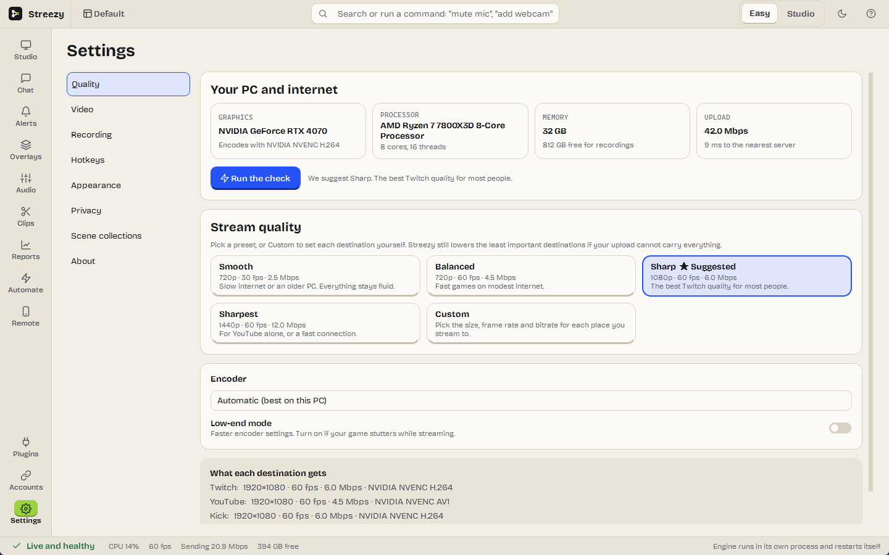 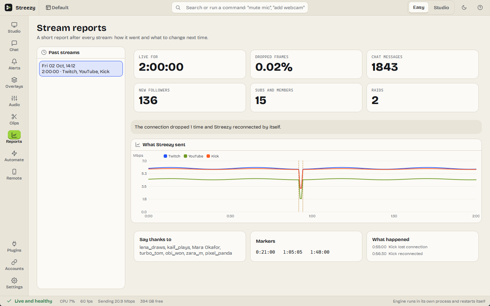

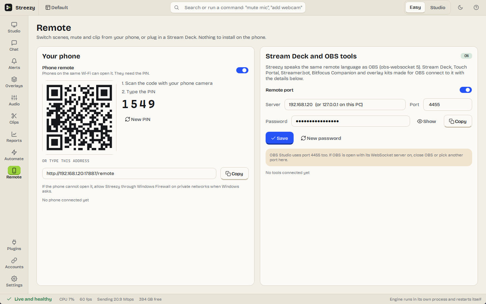 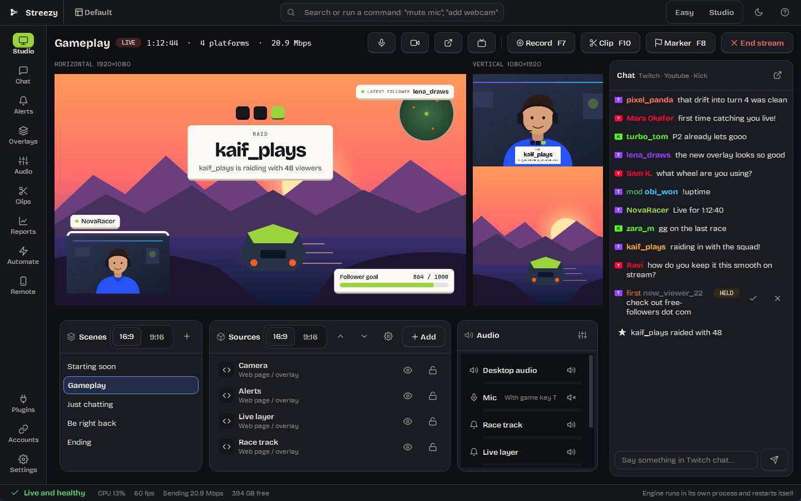

---

## Download & install

Everything is on the **[Releases](../../releases)** page.

| Download | Platform |
|---|---|
| `StreezySetup.exe` | **Windows 10/11** (64-bit): run the installer |
| `manifest.json` | SHA-256 checksum of the installer |

One installer sets up everything, including the video engine and the virtual camera. Streezy updates itself after that, and asks first.

---

## FAQ

**What does it cost?**
Nothing. Streezy is free and stays free. Streaming to several platforms, vertical video and the overlays are not locked behind anything.

**Does it need an account?**
No. No sign-up and no login. You paste each platform's stream key once. Keys are stored in Windows Credential Manager, never in a file.

**Is it the same as OBS Studio?**
Streezy runs on the OBS Studio engine (libobs), so capture, encoding and streaming are just as solid, and OBS plugins and scene collections work. The app around it is new: built for getting a first stream right, with multistreaming, alerts, chat and overlays built in.

**Will streaming to several platforms slow my internet?**
Streezy sends one stream per platform from your PC, so it needs enough upload for all of them. The setup measures your upload and plans the quality to fit. If it's tight, Streezy lowers the less important platforms first.

**Does it phone home?**
No telemetry and no analytics. Streezy connects to the platforms you stream to, to the chats you add, to Cloudflare when you run the internet check, and to GitHub once at start-up to look for updates (which you can switch off). Details are in the [privacy policy](privacy-policy.html).

**Windows says "Windows protected your PC". Is it safe?**
That's Microsoft SmartScreen. It appears for new apps that aren't code-signed yet, and Streezy isn't yet. Click **More info**, then **Run anyway**. You can check the file against the SHA-256 in `manifest.json` on the release.

**What do I need?**
Windows 10 or 11 (64-bit). A graphics card from NVIDIA, AMD or Intel from the last several years is best, because it encodes the video and leaves your processor for the game.

**Is it open source?**
Streezy is licensed under the GPL-3.0, like the OBS engine it runs on. This repository publishes the builds. Until the
source is published here, you can get the complete source code for any release by emailing
[support@zylio.net](mailto:support@zylio.net).

---

## Support this project

Streezy is built by one person, in the evenings. If it saved you a subscription, you can chip in:

### ❤️ [patreon.com/zylio](https://www.patreon.com/zylio)

**Nothing is locked behind it.** Every feature is available to everyone, whether or not anybody ever contributes. There will not be a supporters-only build.

---

**Keywords:** free streaming software, OBS alternative, Streamlabs alternative, free multistream,
stream to Twitch and YouTube at the same time, Kick streaming software, TikTok live from PC,
vertical streaming, YouTube Shorts live, stream overlays, stream alerts, push to talk for streaming,
keep Discord off stream, game audio only, Stream Deck, phone remote, no watermark, no subscription,
streaming app for beginners, Windows streaming software.

---

Built by **[zylio](https://zylio.net)**, an independent software studio making fast, honest tools.

**Product page:** [zylio.net/software/streezy](https://zylio.net/software/streezy)

© 2026 zylio · Faisal Malik. Streezy is free software under the GPL-3.0.
