# Streezy user guide

Streezy is a free app for live streaming on Windows. It runs on the same video engine as OBS Studio, so capture, encoding and streaming are just as reliable. Around that engine it adds a simpler window, a setup that builds everything for you, and multistreaming, alerts, chat and overlays out of the box.

This guide takes you from nothing to your first stream, then explains every part of the app. If you have never streamed before, read **Part 1** and **Part 3** first. The rest is there when you need it.

In the pictures, **blue numbered boxes** show what to click. The numbers match the steps under each picture. Everything shown is demo content: the game, webcam, chat and channel names are made up.

## Contents

**Part 1. Get started**
1. [What you need](#1-what-you-need)
2. [Install Streezy](#2-install-streezy)
3. [The first-run setup](#3-the-first-run-setup)
4. [A tour of the window](#4-a-tour-of-the-window)

**Part 2. Build what viewers see**
5. [Scenes](#5-scenes)
6. [Sources: your game, camera, screen and more](#6-sources-your-game-camera-screen-and-more)
7. [Arrange things in the preview](#7-arrange-things-in-the-preview)
8. [Audio: your mic and PC sound](#8-audio-your-mic-and-pc-sound)
9. [Overlays](#9-overlays)
10. [Alerts](#10-alerts)
11. [Chat](#11-chat)

**Part 3. Go live**
12. [Add where you stream](#12-add-where-you-stream)
13. [Pick your quality](#13-pick-your-quality)
14. [Go live](#14-go-live)
15. [While you are live](#15-while-you-are-live)
16. [End the stream](#16-end-the-stream)

**Part 4. Horizontal and vertical**
17. [Stream vertical for Shorts, TikTok and Reels](#17-stream-vertical-for-shorts-tiktok-and-reels)

**Part 5. More tools**
18. [Studio mode](#18-studio-mode)
19. [Recording and clips](#19-recording-and-clips)
20. [Stream reports](#20-stream-reports)
21. [Automate](#21-automate)
22. [Phone remote and Stream Deck](#22-phone-remote-and-stream-deck)
23. [Plugins](#23-plugins)
24. [Scene collections and moving from OBS](#24-scene-collections-and-moving-from-obs)
25. [Hotkeys](#25-hotkeys)
26. [Command palette, mini mode, projector and virtual camera](#26-command-palette-mini-mode-projector-and-virtual-camera)
27. [Other settings](#27-other-settings)

**Part 6. Help**
28. [The stream doctor](#28-the-stream-doctor)
29. [If something goes wrong](#29-if-something-goes-wrong)
30. [Updating and uninstalling](#30-updating-and-uninstalling)
31. [Privacy and where your files are](#31-privacy-and-where-your-files-are)
32. [Words you will see](#32-words-you-will-see)
33. [Get help](#33-get-help)

---

# Part 1. Get started

## 1. What you need

- **A Windows PC:** Windows 10 (version 1809 or newer) or Windows 11, 64-bit.
- **A graphics card is recommended.** Streezy uses NVIDIA, AMD or Intel graphics to encode your stream, which leaves your processor free for games. Without one it still works, using the processor.
- **Internet upload speed.** Each platform needs about 2.5 to 12 Mbps of *upload*, depending on quality. Streezy measures yours during setup and picks a quality that fits.
- **An account on the platform you want to stream to**, such as Twitch, YouTube, Kick, Facebook, TikTok or X. Streezy itself needs no account.
- **Optional:** a webcam and a microphone. A headset mic is fine.

## 2. Install Streezy

1. Download **StreezySetup.exe** from [zylio.net/software/streezy](https://zylio.net/software/streezy) or from the [releases page](https://github.com/faisalrasheed442/streezy-releases/releases/latest). It is one file; everything Streezy needs is inside it.
2. Open the file. Windows asks for permission to install, because Streezy also installs its virtual camera. Click **Yes**.
3. If Windows shows **"Windows protected your PC"**, click **More info**, then **Run anyway**. Windows shows this for new apps it has not seen many times yet.
4. Follow the installer. You can tick **Create a desktop shortcut**.
5. On the last page, leave **Launch Streezy** ticked and click **Finish**.

Streezy starts with a small window saying *Starting the video engine…*, then opens the setup.

> Streezy installs to `C:\Program Files\Streezy`. Your own settings and scenes are kept separately in `%APPDATA%\Streezy`, and recordings go to `%USERPROFILE%\Videos\Streezy`.

## 3. The first-run setup

The first time Streezy opens, a short setup asks nine questions and builds your scenes, overlays, alerts and mic for you. It takes about two minutes. **You can change every answer later.**

### Step 1: Welcome

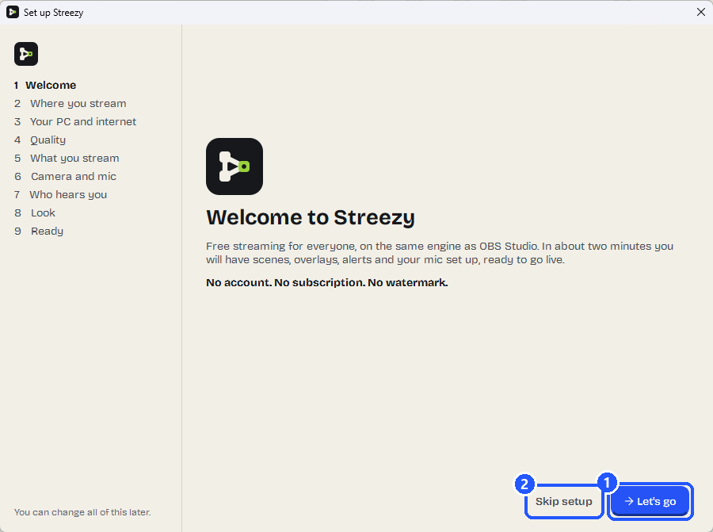

1. Click **Let's go** to start.
2. Or click **Skip setup** to go straight to an empty Studio. Streezy then builds the standard *Games* scenes for you. You can run through the same choices later in the app.

### Step 2: Where you stream

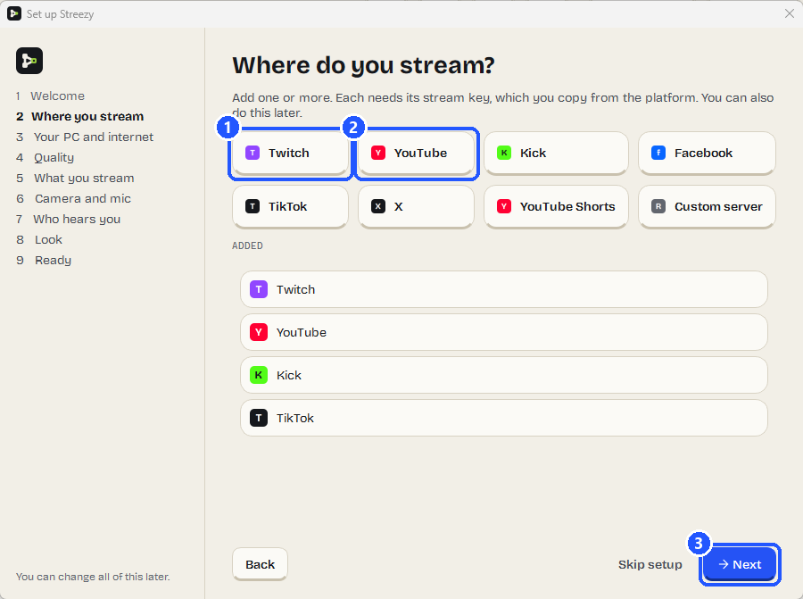

1. Click the platform you stream to, here **Twitch**. A small window opens asking for that platform's stream key (see [section 12](#12-add-where-you-stream) for where to find it).
2. Add as many platforms as you like: **YouTube**, Kick, Facebook, TikTok, X, YouTube Shorts or any custom server. Everything you add appears under **ADDED**.
3. Click **Next**.

You can skip this step and add platforms later in **Accounts**. Without any, you can still record.

### Step 3: Your PC and internet

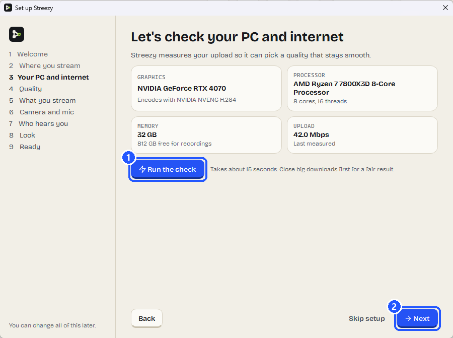

1. Click **Run the check**. Streezy looks at your graphics card, processor and memory, and tests your upload speed. It takes about 15 seconds. Pause big downloads first for a fair result.
2. Click **Next**.

### Step 4: Quality

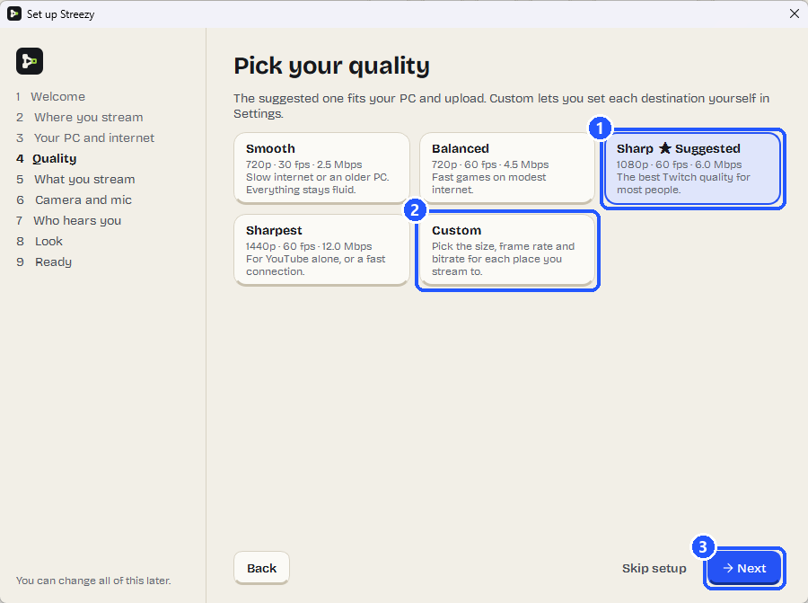

1. Streezy marks the preset that suits your PC and upload with **★ Suggested**. Most people should keep it.
2. **Custom** lets you set size, frame rate and bitrate for each platform yourself, later in Settings.
3. Click **Next**.

| Preset | Picture | Upload per platform | Good for |
|---|---|---|---|
| **Smooth** | 720p, 30 fps | 2.5 Mbps | Slow internet or an older PC |
| **Balanced** | 720p, 60 fps | 4.5 Mbps | Fast games on modest internet |
| **Sharp** | 1080p, 60 fps | 6 Mbps | The best Twitch quality for most people |
| **Sharpest** | 1440p, 60 fps | 12 Mbps | YouTube alone, or a fast connection |

### Step 5: What you stream

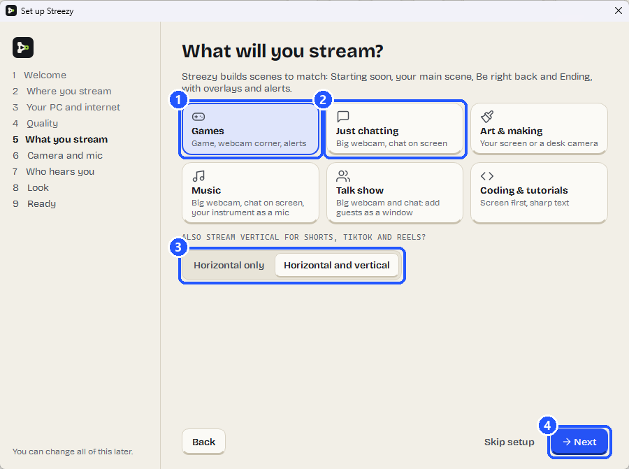

1. Pick the card that fits, for example **Games**: your game full screen, your webcam in a corner, and alerts.
2. Or **Just chatting** for a big webcam with chat on screen. There are also cards for art, music, talk shows, and coding or tutorials.
3. Under **Also stream vertical for Shorts, TikTok and Reels?**, choose **Horizontal and vertical** if you also want a 9:16 phone-shaped stream (see [Part 4](#part-4-horizontal-and-vertical)). Otherwise leave **Horizontal only**.
4. Click **Next**.

Whichever card you pick, you get these scenes: **Starting soon**, your main scene, **Be right back** and **Ending**. Each is filled with overlays that follow your name and colour.

### Step 6: Your camera and mic

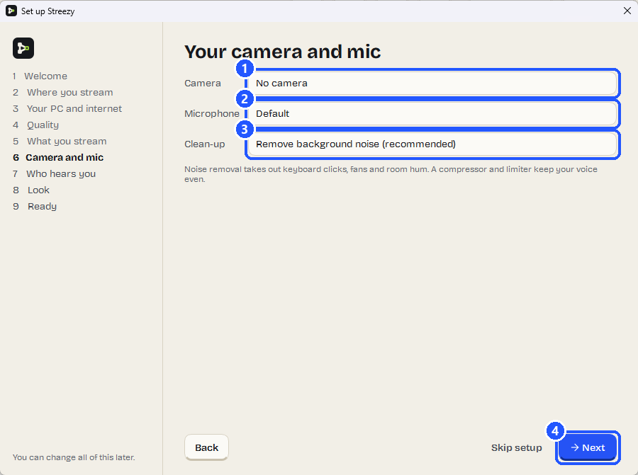

1. **Camera:** pick your webcam, or **No camera**.
2. **Microphone:** pick your mic.
3. **Clean-up:** keep **Remove background noise (recommended)**. It takes out keyboard clicks, fans and room hum, and keeps your voice at an even level. With an NVIDIA RTX card you can choose **NVIDIA noise removal** instead.
4. Click **Next**.

### Step 7: Who hears your mic

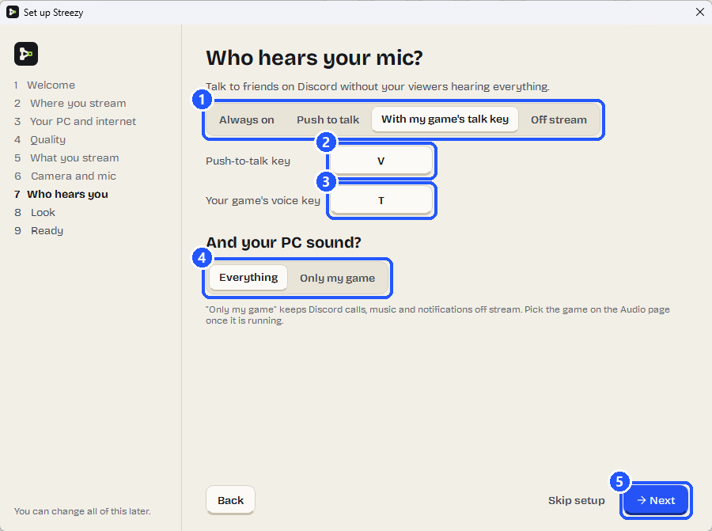

Streezy can keep your Discord or party chat off stream. That is one of the most common problems new streamers have.

1. Choose when viewers hear your mic:
   - **Always on:** viewers hear you all the time.
   - **Push to talk:** viewers hear you only while you hold a key.
   - **With my game's talk key:** your mic goes on stream when you press the key you already use for in-game voice. You can talk to Discord freely the rest of the time.
   - **Off stream:** viewers never hear your mic.
2. **Push-to-talk key:** click the box and press the key you want (default **V**).
3. **Your game's voice key:** click the box and press your game's voice key (default **T**).
4. **And your PC sound?** **Everything** sends all PC sound to the stream. **Only my game** sends just your game, so Discord calls, music and notifications stay off stream. You pick the game later on the Audio page, once it is running.
5. Click **Next**.

### Step 8: Look

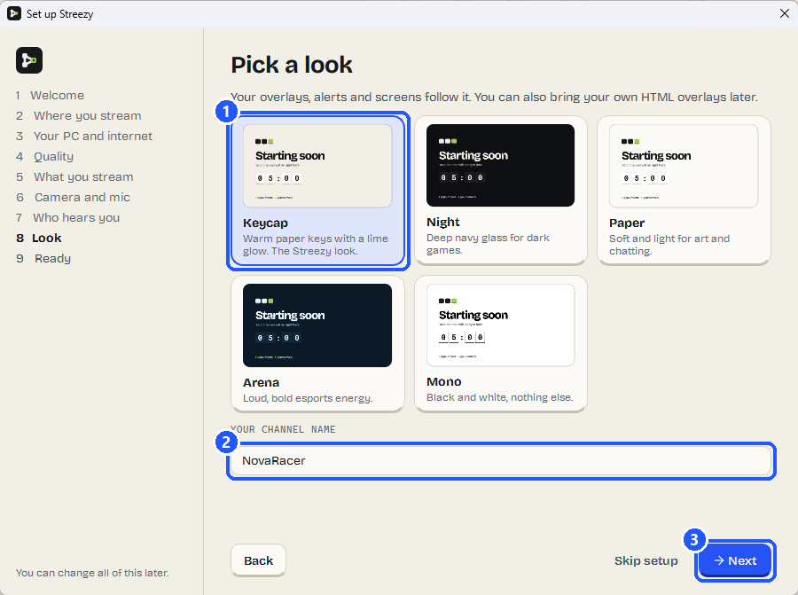

1. Pick a look for your overlays. Each picture shows that look's *Starting soon* screen:
   - **Keycap:** warm paper keys with a lime glow, the Streezy look.
   - **Night:** deep navy glass, for dark games.
   - **Paper:** soft and light, for art and chatting.
   - **Arena:** loud, bold esports energy.
   - **Mono:** black and white, nothing else.
2. Type **your channel name**. It appears on your Starting soon screen and your name tag.
3. Click **Next**.

### Step 9: Ready

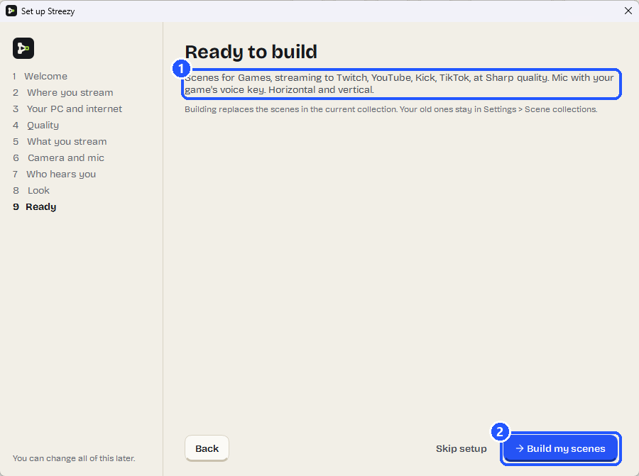

1. Check the summary.
2. Click **Build my scenes**. A few seconds later the Studio opens with everything in place.

## 4. A tour of the window

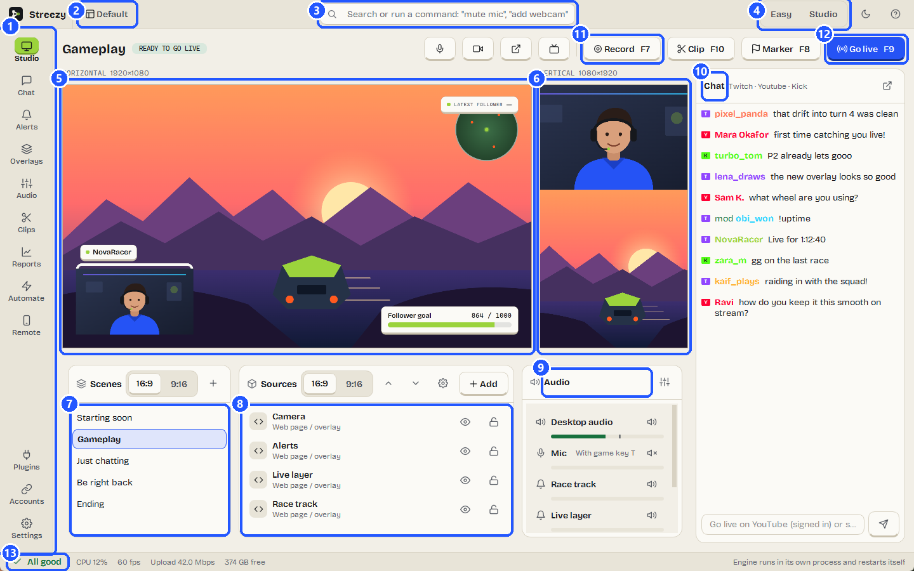

1. **The left rail.** It holds every page: Studio, Chat, Alerts, Overlays, Audio, Clips, Reports, Automate and Remote at the top, and Plugins, Accounts and Settings at the bottom.
2. **Scene collection.** It shows your current set of scenes. Click it to switch to another set (see [section 24](#24-scene-collections-and-moving-from-obs)).
3. **Search.** Type a command or a scene name, such as "mute mic" or "add webcam". **Ctrl+K** opens it from anywhere.
4. **Easy / Studio.** Easy mode puts scenes on air the moment you click them. Studio mode lets you prepare the next scene first (see [section 18](#18-studio-mode)).
5. **The preview.** This is exactly what your viewers see.
6. **The vertical preview**, only if you turned vertical on.
7. **Scenes.** Your scenes; click one to switch to it.
8. **Sources.** Everything in the current scene: game, camera, overlays.
9. **Audio.** A level meter and mute button for each sound.
10. **Chat** from every platform in one list.
11. **Record**, **Clip** and **Marker** buttons.
12. **Go live.**
13. **Status bar.** It says **All good** when everything is fine, or names the problem if something isn't. Click it to open the [stream doctor](#28-the-stream-doctor). Next to it you see processor use, frames per second, upload and free disk space.

### The toolbar

1. **Mic:** mute your mic on stream. Discord still hears you.
2. **Camera:** hide or show your camera on stream.
3. **Mini mode:** a small controller that floats over your game (see [section 26](#26-command-palette-mini-mode-projector-and-virtual-camera)).
4. **Projector:** show your stream full screen on another monitor.
5. **Record** (F7): start or stop recording to your PC.
6. **Clip** (F10): save the last moments as a clip.
7. **Marker** (F8): note a moment to find later.
8. **Go live** (F9).

The keys in brackets work even while your game has focus.

---

# Part 2. Build what viewers see

## 5. Scenes

A **scene** is one screen layout. Typical scenes are *Starting soon*, *Gameplay*, *Just chatting*, *Be right back* and *Ending*. You switch between them while live, and viewers see the change straight away.

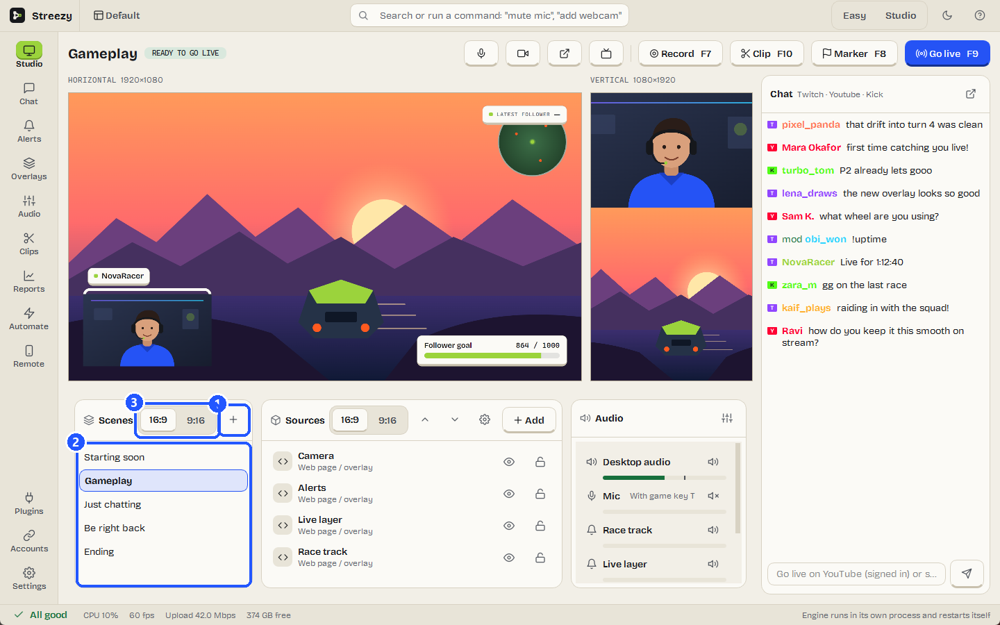

1. **+** adds a new scene. Type a name and press Enter.
2. **Click a scene** to put it on air. **Double-click** it to rename it, and **drag** scenes to reorder them.
3. **16:9 / 9:16** switches between your horizontal and vertical scenes. It only appears when the vertical canvas is on.

**Right-click a scene** for more:

1. **Rename…**
2. **Duplicate:** a copy to change without touching the original.
3. **Delete:** removes the scene. Sources used only in that scene are removed too.

> Tip: the **Ctrl+Shift+B** key jumps straight to your *Be right back* scene.

## 6. Sources: your game, camera, screen and more

A **source** is anything inside a scene: your game, webcam, a picture, an overlay, some text.

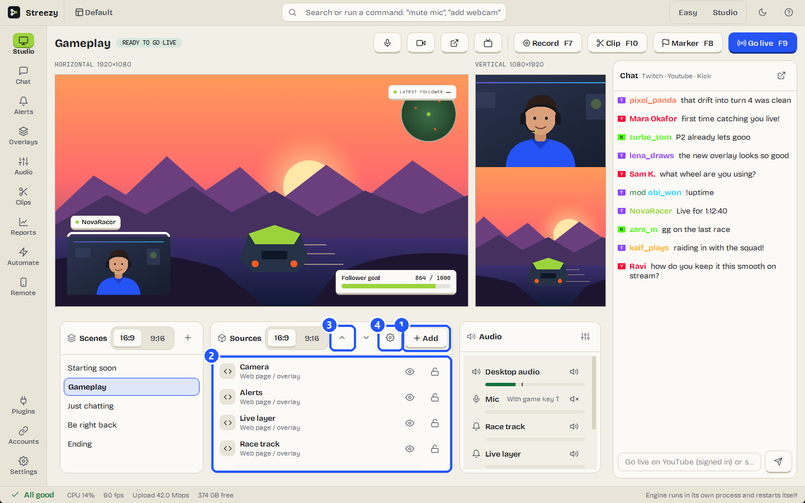

1. **Add** puts something new into the current scene.
2. **The list** shows what is in the scene. The eye icon hides or shows each item, and the padlock locks it in place. Items higher in the list are drawn on top.
3. **Up and down arrows** move the selected item in front of or behind others.
4. **The gear** opens the selected item's settings. Double-clicking an item does the same.

### Adding a source

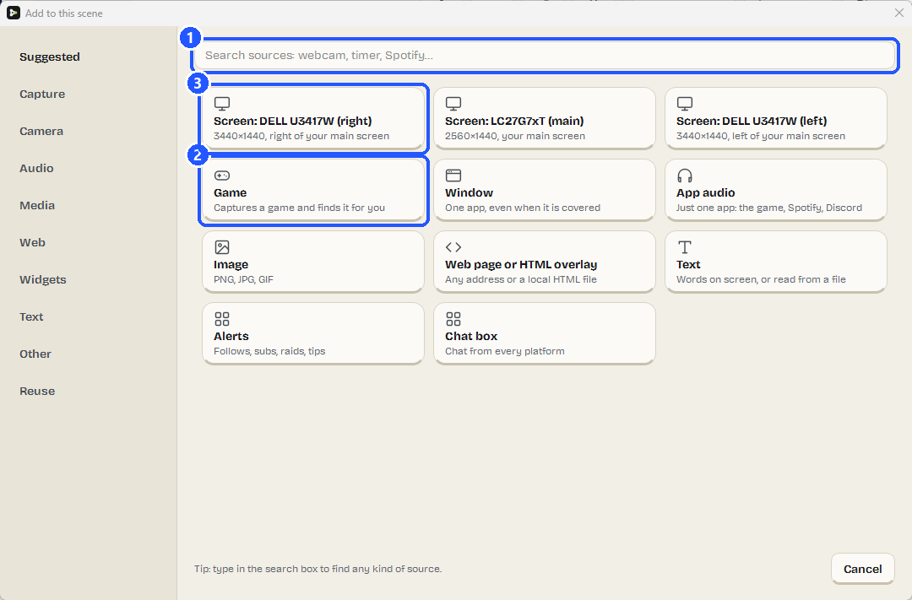

1. **Search** for any kind of source, for example "webcam", "timer" or "Spotify".
2. **Game** captures a game and finds it by itself. Start your game, and the source shows it.
3. **Screen** tiles: Streezy lists each of your monitors by name and position (main, left, right). Pick the one to show.

The categories on the left contain everything else:

| Category | What it adds |
|---|---|
| **Capture** | **Game**, **Window** (one app, even when it is covered), **Screen** (one monitor) |
| **Camera** | Your webcams by name, or **Webcam or capture card** for consoles and camcorders |
| **Audio** | **Microphone**, **App audio** (just one app: the game, Spotify, Discord), **Desktop audio** (everything your PC plays) |
| **Media** | **Image**, **Video or sound file**, **Slideshow**, **VLC playlist** |
| **Web** | **Web page or HTML overlay** (any web address or a local HTML file) |
| **Widgets** | **Alerts**, **Chat box**, **Goal bar**, **Live layer**, **Starting soon screen**, **Be right back screen**, **Ending screen** |
| **Text** | **Text**: words on screen, or read from a file |
| **Other** | **Colour**: a plain colour block |
| **Reuse** | Your other scenes (to put a whole scene inside this one), and sources you already have in other scenes |

After you pick a source, its settings open so you can choose, for example, which window to capture.

Streezy also helps with a few common situations:
- **A second Game source** reuses the game capture you already have, so it shows your game straight away.
- **Your first microphone** becomes your stream mic, so push-to-talk, clean-up and the mute key work on it.
- **Adding App audio when PC sound is set to Everything** shows a warning, because that app would be heard twice.

### Source settings

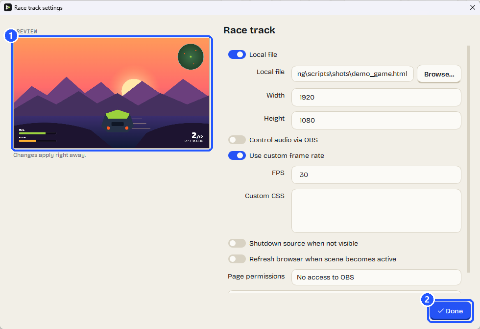

1. The **preview** on the left shows the result as you change things. *Changes apply right away.*
2. Click **Done** when you are finished.

### Filters

Filters change how a source looks or sounds. Right-click a source and choose **Audio filters…** or **Filters (picture)…**.

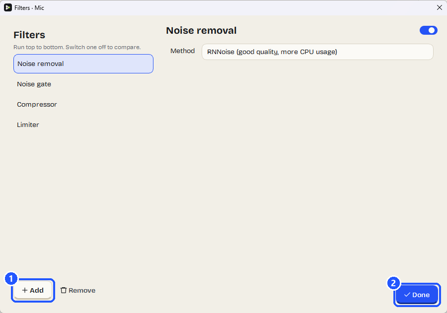

1. **Add** a filter. Filters run from top to bottom. Switch one off to compare.
2. Click **Done**.

| For sound | For picture |
|---|---|
| Noise removal, Noise gate, Compressor, Limiter, Gain, 3-band EQ, Expander, Upward compressor | Crop, Colour correction, Green screen (chroma key), Colour key, Image mask, Sharpen, Scroll, Look-up table (LUT), Background removal (NVIDIA RTX), Luma key, Delay |

> Your mic already has noise removal, a noise gate, a compressor and a limiter from setup. You usually don't need to add anything.

## 7. Arrange things in the preview

1. **Click** an item in the preview to select it. A box with a handle appears around it.

Then:
- **Drag** to move it. It snaps to the edges and centre of the screen, and a guide line shows when it does. Hold **Shift** to move freely.
- **Drag the bottom-right corner** to resize it. It keeps its shape; hold **Ctrl** to stretch it.
- **Arrow keys** nudge it by 1 pixel, or by 10 pixels with **Shift**. Click the preview first.
- **Delete** removes it from the scene (Streezy asks first).
- **Double-click** opens its settings.
- **Right-click** opens the menu below.

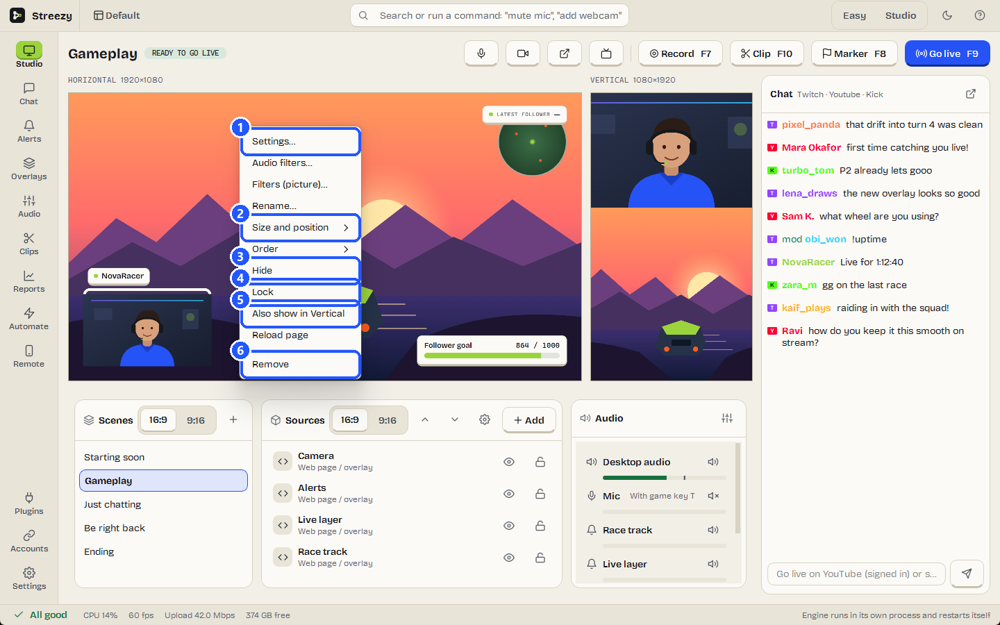

1. **Settings…**
2. **Size and position:** **Fit to screen**, **Fill the screen**, **Stretch to screen**, **Centre**, **Reset size**, or **Exact position…** to type exact numbers and crop the edges.
3. **Hide** keeps it in the scene without showing it.
4. **Lock** stops it from being moved or resized by accident.
5. **Also show in Vertical** copies it onto your vertical canvas (see [Part 4](#part-4-horizontal-and-vertical)).
6. **Remove** takes it out of this scene.

The menu also has **Rename…**, **Order** (bring to front, send to back) and, for web pages, **Reload page**.

## 8. Audio: your mic and PC sound

Open **Audio** in the left rail.

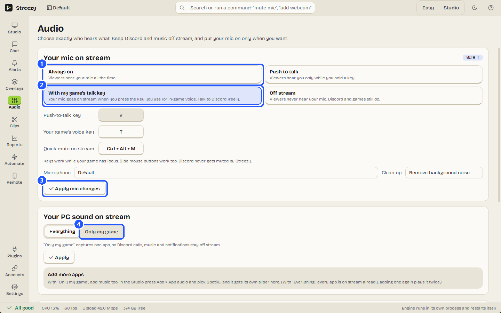

**Your mic on stream:**
1. **Always on:** viewers hear your mic all the time.
2. **With my game's talk key:** your mic goes on stream only while you hold your game's voice key, so you can talk to Discord freely. The other choices are **Push to talk** and **Off stream**.
   - Under the cards, set your **Push-to-talk key**, **Your game's voice key** and **Quick mute on stream** (default **Ctrl+Alt+M**). Click a box, then press the key. Side mouse buttons work too.
   - Pick your **Microphone** and **Clean-up**.
3. Click **Apply mic changes**.

**Your PC sound on stream:**

4. **Everything** sends all PC sound. **Only my game** sends just one app. When you choose it:
   - start your game,
   - click the refresh button,
   - pick the game from the list,
   - click **Apply**.

   To add music as well, go to the Studio and press **Add > App audio**, then pick Spotify. It gets its own slider.

**The Mixer** (further down the page) has one row per sound:
- **Mute on stream** (speaker icon) and a **volume slider** in decibels.
- **Who hears it:**
  - **Only viewers hear it** (normal).
  - **Only you hear it:** plays in your headphones and stays off stream.
  - **You and viewers.**
- **Stream / Mic / Game / Other** ticks: which recording tracks the sound goes to (see [section 19](#19-recording-and-clips)).
- **Filters** button: noise removal, compressor, EQ.

Under the mixer, **Your headphones** chooses where "only you" sounds play.

> **Hearing something twice?** If PC sound is set to **Everything** and you also added an app with **App audio**, that app plays twice. Streezy warns you about this. Either switch PC sound to **Only my game**, or remove the extra source.

## 9. Overlays

Overlays are the graphics on top of your stream: the *Starting soon* countdown, a name tag, a goal bar, alerts and the on-screen chat. Open **Overlays** in the left rail.

### Look and your details

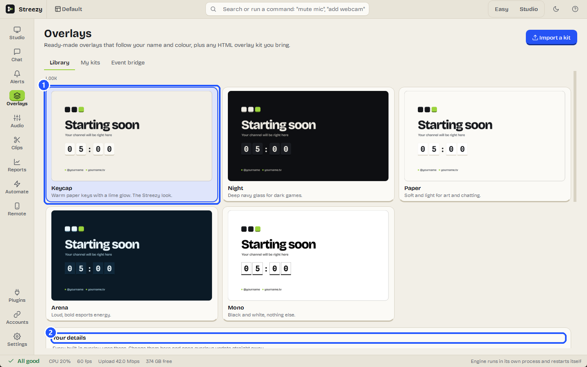

1. **Pick a look.** Every overlay already in your scenes switches to it at once.
2. **Your details:** fill these in once and every overlay uses them:
   - **Name:** your channel name.
   - **Stream title:** what today's stream is about.
   - **Be right back message.**
   - **Next stream:** shown on the Ending screen, for example "Next stream: Friday 8 pm".
   - **Socials:** separated by commas.
   - **Accent colour.**
   - **Goal:** a label and numbers for the goal bar.

   Then click **Save and update overlays**. Overlays update straight away, even while you are live.

### Add an overlay to a scene

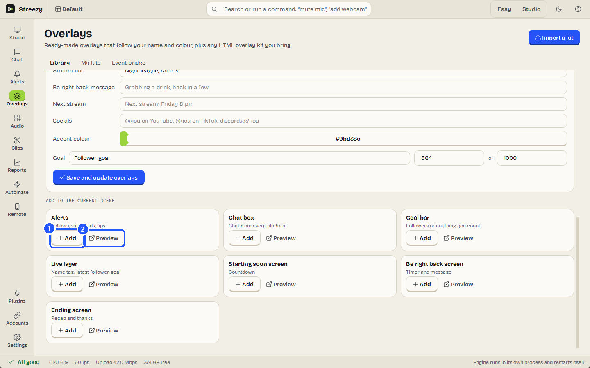

Scroll down to **Add to the current scene**:
1. **Add** puts that overlay into the scene you are on.
2. **Preview** opens it in your web browser to look at first.

| Overlay | What it shows |
|---|---|
| **Alerts** | Pop-ups for subs, raids, bits, Super Chats and more |
| **Chat box** | Chat from every platform, on screen |
| **Goal bar** | A goal, for example followers |
| **Live layer** | A webcam frame, your name tag, latest follower and goal |
| **Starting soon screen** | A countdown, your stream title and socials |
| **Be right back screen** | A timer and your message |
| **Ending screen** | A recap of the stream and a thank-you list |

### Bring your own overlays (kits)

You can use any folder of HTML overlays: ones made for OBS, ones you bought from a designer, or ones made for your channel.

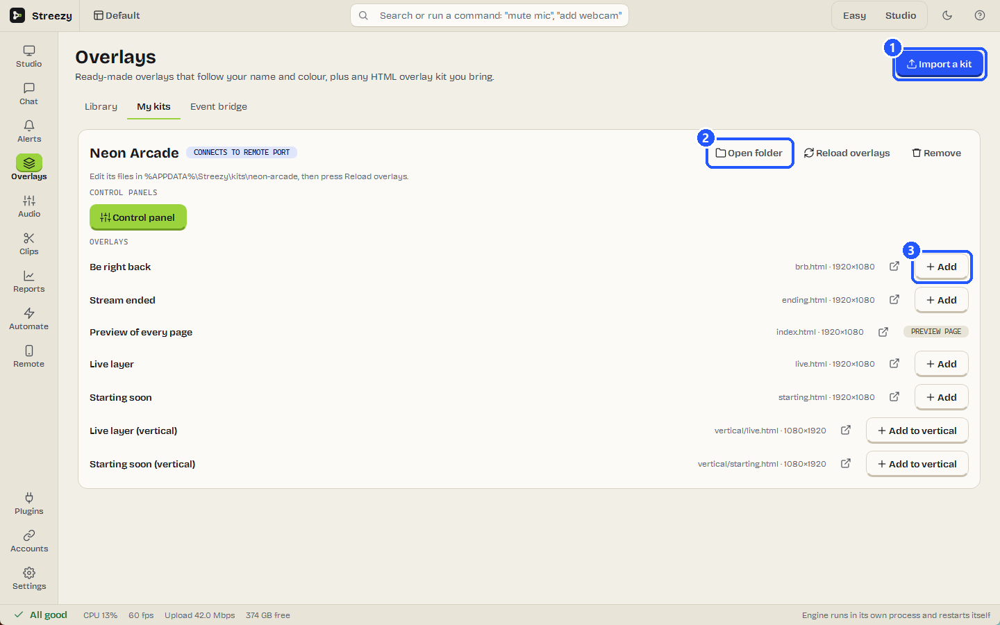

1. Click **Import a kit** and choose **A folder** or **A .zip file**. Streezy adds each HTML page as an overlay. Pages named *control*, *dock*, *panel* or *dashboard* become **control panels**, which open in a small window.
2. **Open folder** to edit the kit's files. Then press **Reload overlays**.
3. **Add** puts a page into your current scene. Pages made for phones show **Add to vertical**.

Many kits made for OBS talk to OBS's remote port. Streezy provides the same port, so they work here too. The **Event bridge** tab sends Streezy's events (subs, raids and so on) to kits in the format each kit expects.

You can also add any web address or HTML file yourself with **Add > Web page or HTML overlay** in the Studio.

## 10. Alerts

Alerts are the pop-ups that thank viewers on screen. Open **Alerts** in the left rail.

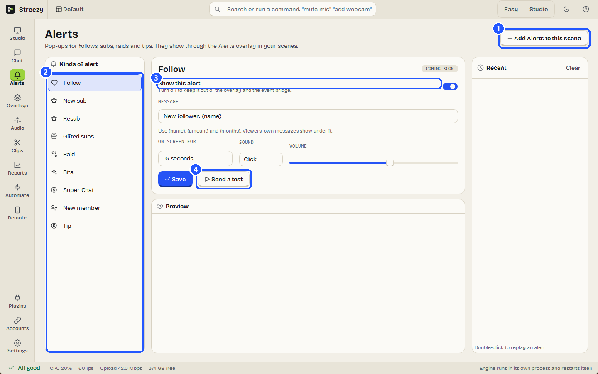

1. **Add Alerts to this scene** puts the Alerts overlay in your current scene. The setup already did this for your main scene.
2. **Pick a kind of alert** from the list.
3. **Show this alert** turns that kind on or off. Below it you set:
   - **Message:** use `{name}`, `{amount}` and `{months}`, which are filled in for you.
   - **On screen for:** how many seconds.
   - **Sound** and **Volume**.
   - For some kinds, **Read the viewer's message aloud**.
4. **Send a test** to see and hear it. Then click **Save**.

The **Preview** in the middle shows the result, and **Recent** on the right lists the latest alerts. Double-click one to replay it.

| Alert | Comes from |
|---|---|
| New sub, Gifted subs, Raid | Twitch and Kick |
| Resub, Bits | Twitch |
| Super Chat, New member | YouTube |
| Follow, Tip | Coming in a later update. **Send a test** already works. |

Alerts read events from your chat connection, so add your channels in **Chat** (next section).

## 11. Chat

Streezy shows Twitch, YouTube and Kick chat in one list. **Reading chat needs no sign-in.**

### Connect your channels

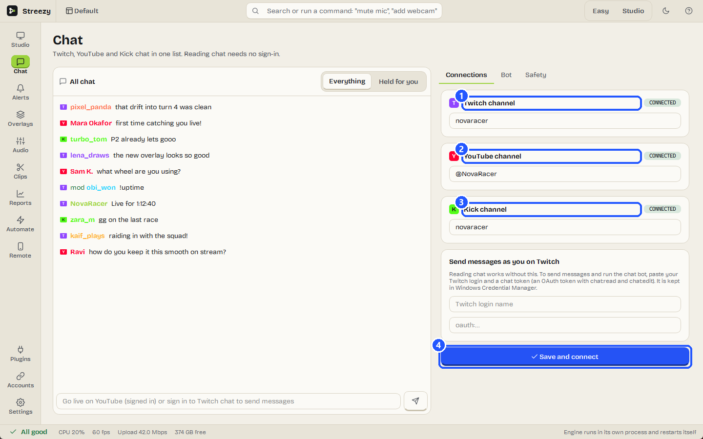

1. **Twitch channel:** the name in your Twitch link, for example `lena_draws`. A full link works too.
2. **YouTube channel:** your @handle or any link to your channel. YouTube chat appears by itself once you are live. Until then the card says **Not live**.
3. **Kick channel:** the name in your Kick link.
4. Click **Save and connect**. Each card then shows **Connected**.

**Sending messages:**
- **YouTube:** if you signed in with YouTube (see [section 12](#12-add-where-you-stream)), you can type in the box under the chat while you are live on YouTube.
- **Twitch:** fill in **Send messages as you on Twitch** with your Twitch login and a chat token. Twitch sign-in inside Streezy is coming in a later update.

### Chat bot

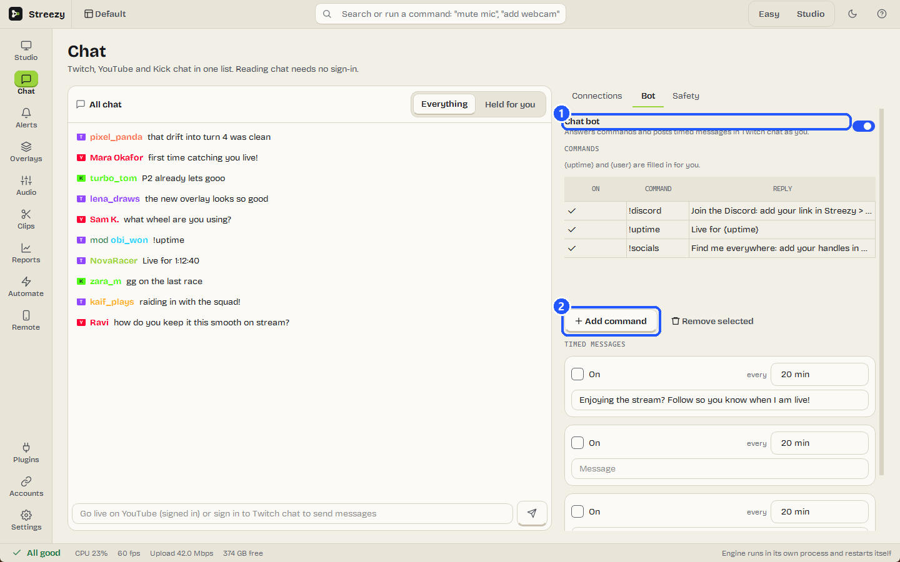

1. **Chat bot:** turn it on to answer commands and post timed messages in Twitch chat as you.
2. **Add command:** for example `!discord` with your Discord link as the reply. `{uptime}` and `{user}` are filled in for you.

Below that, **Timed messages** post something every few minutes while you are live. Click **Save bot** when you are done. The bot needs the Twitch login and token above.

### Safety

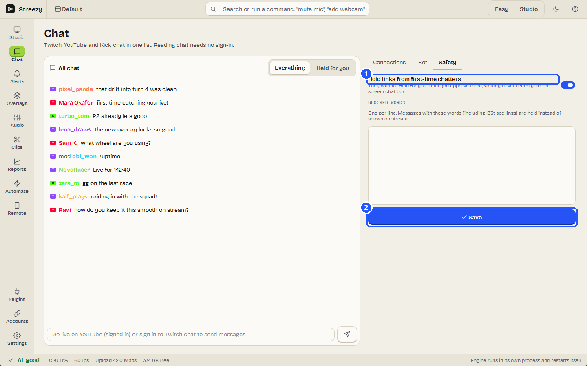

1. **Hold links from first-time chatters** (on by default). Links from new Twitch chatters wait in **Held for you** at the top of the chat until you approve them, so they never reach your on-screen chat box.
2. Type **blocked words**, one per line. Messages containing them are held too, including look-alike spellings such as `fr33`. Then click **Save**.

Held messages show a ✓ to put them on stream and an ✗ to drop them.

---

# Part 3. Go live

## 12. Add where you stream

Open **Accounts** in the left rail. A **destination** is one place you stream to. You can stream to as many at once as your internet can carry.

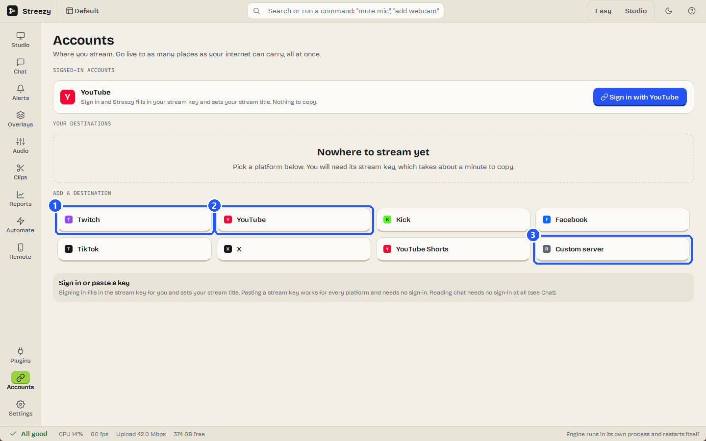

1. Click a platform, for example **Twitch**.
2. Or **YouTube**: you can also sign in instead of copying a key (see below).
3. **Custom server** works with anything that takes RTMP, RTMPS or SRT.

### Add a stream key

A **stream key** is like a password that lets an app stream to your channel. You copy it once from the platform's website.

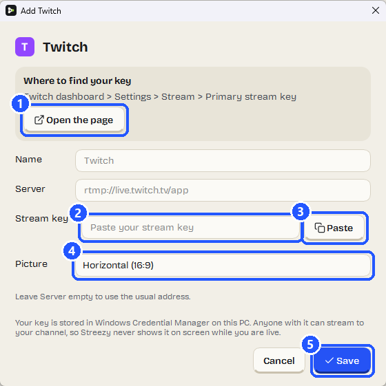

1. **Open the page** opens the right page on the platform's website. The grey box above tells you exactly where the key is.
2. Copy the key there, then **paste it** into **Stream key**…
3. …or click **Paste**.
4. **Picture:** leave **Horizontal (16:9)**, or choose **Vertical (9:16)** for Shorts, TikTok and Reels.
5. Click **Save**.

Leave **Server** empty; Streezy fills in the usual address. Only Custom server, TikTok and X need one, and you copy it from the same page as the key.

| Platform | Where to find the key |
|---|---|
| **Twitch** | Twitch dashboard > Settings > Stream > Primary stream key |
| **YouTube** | YouTube Studio > Go live > Stream > Stream key. Or sign in instead (below). |
| **Kick** | Kick dashboard > Settings > Stream URL & Key. Copy both. |
| **Facebook** | Facebook Live Producer > Streaming software > Stream key |
| **TikTok** | TikTok LIVE Center > Streaming software. Needs TikTok LIVE access, and the key changes each stream. |
| **X** | X Live Studio > Sources > RTMP. Needs X Premium. |
| **YouTube Shorts** | YouTube Studio > Go live > Stream. Create a second stream key for the vertical stream. |

> **Keep your keys secret.** Anyone with your key can stream to your channel. Streezy stores keys in Windows Credential Manager, never in a file, and hides them on screen. If a key ever leaks, reset it on the platform's website and paste the new one into Streezy.

### Your destinations

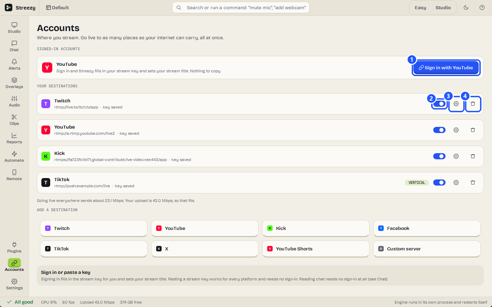

1. **Sign in with YouTube** (see below).
2. **The switch** decides whether this destination is included when you go live.
3. **Edit** changes the key, name or picture.
4. **Remove** deletes the destination and its key from this PC.

Under the list, Streezy tells you how much upload going live everywhere needs, and whether your connection has room.

### Sign in with YouTube

Signing in means you never copy a YouTube key. Streezy fills it in, and sets your stream title, visibility and description when you go live.

1. Click **Sign in with YouTube**. Google's sign-in page opens in your browser.
2. Pick the Google account that owns your channel. Allow **Manage your YouTube account**.
3. The browser says *You are signed in*. Go back to Streezy.

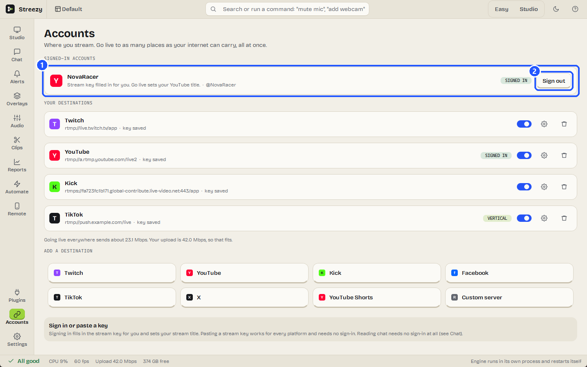

1. Your channel now appears, with *Stream key filled in for you*, and your YouTube destination is marked **Signed in**.
2. **Sign out** whenever you like. That removes Streezy's access at Google. Your saved stream key stays, so you can still go live.

Your sign-in is kept on your PC in Windows Credential Manager. Nothing is sent to a zylio server. Live streaming must be turned on for your channel; the first time, YouTube can take up to 24 hours to allow it.

## 13. Pick your quality

Setup already chose a quality. To change it, open **Settings > Quality**.

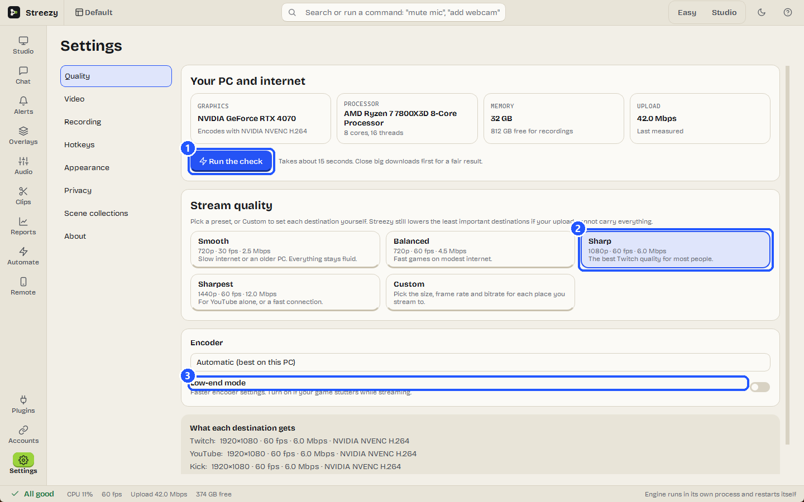

1. **Run the check** measures your upload again, which is worth doing if you change internet plans or move house.
2. **Pick a preset.** **★ Suggested** marks the one that fits. **Custom** lets you choose size, frame rate, bitrate and codec for each destination.
3. **Low-end mode:** turn this on if your game stutters while streaming.

**Encoder** is normally **Automatic (best on this PC)**. **What each destination gets** at the bottom shows exactly what each platform will receive.

If your upload can't carry every destination at full quality, Streezy lowers the least important ones to fit. They are marked *lowered to fit*.

## 14. Go live

Click **Go live** (or press **F9**).

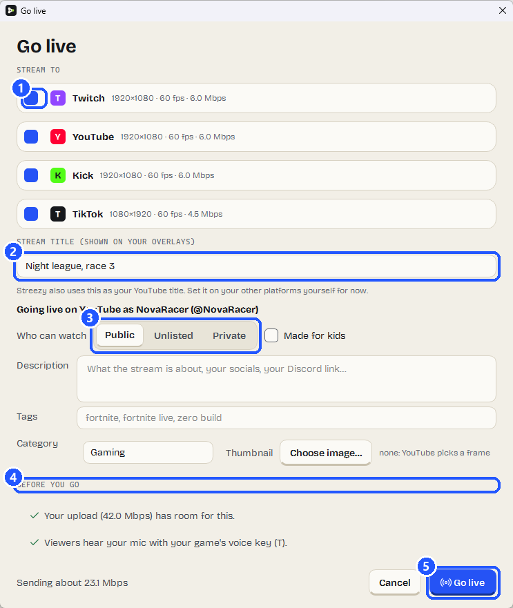

1. **Tick where to stream this time.** Each line shows the size, frame rate and upload that destination gets.
2. **Stream title:** shown on your overlays. If you signed in with YouTube, it also becomes your YouTube title.
3. **YouTube options** (only when signed in): **Public**, **Unlisted** or **Private**, **Made for kids**, plus description, tags, category and a thumbnail.
4. **Before you go:** Streezy checks everything first:
   - stream keys
   - upload room
   - your mic
   - a game that isn't showing yet
   - sound that would play twice
   - two destinations sharing one key

   A green tick is fine, an orange warning is worth reading, and a red cross must be fixed before you can go live.
5. Click **Go live**.

A few seconds later the button turns red and says **End stream**.

> **YouTube** usually takes 10 to 20 seconds before your stream appears on YouTube.

## 15. While you are live

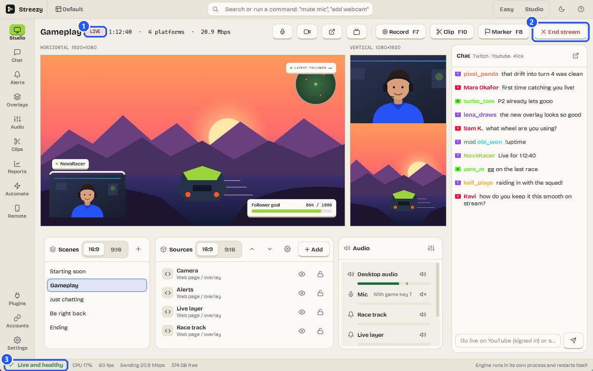

1. **LIVE** with the time live, the number of platforms and the upload being sent. Hover over it to see the platform names.
2. **End stream** ends the stream on every platform.
3. **The status bar** says **Live and healthy**. If something goes wrong, it names it, for example "Kick: reconnecting" or "Twitch: upload can't keep up". Click it for advice.

Things you can do while live:
- **Switch scenes** by clicking them, or press **Ctrl+Shift+B** for Be right back.
- **Mute your mic** on stream with the mic button or **Ctrl+Shift+M**.
- **Save a clip** with **F10**, add a **marker** with **F8**, or start **recording** with **F7**.
- **Change overlays and alerts.** Changes show at once.
- **Use mini mode** (**Ctrl+Shift+S**) to keep controls over your game.

**If your internet drops**, Streezy reconnects by itself and tells you when each platform is back. You don't need to do anything.

**If the video engine ever stops**, Streezy restarts it, reloads your scenes and reconnects your stream by itself, usually within seconds. A message tells you it is *Back on track*.

## 16. End the stream

Click **End stream** and confirm. With the hotkey, press **F9** twice within 3 seconds.

If you set an **ending scene** in [Automate](#21-automate), Streezy shows it for a few seconds before stopping, so the stream doesn't just cut off. Press End again to stop straight away.

When the stream ends, Streezy opens its **report** (see [section 20](#20-stream-reports)). If you went live with YouTube sign-in, the YouTube broadcast is ended too.

---

# Part 4. Horizontal and vertical

## 17. Stream vertical for Shorts, TikTok and Reels

Phones show video upright (9:16). Streezy can stream a **second, vertical picture** at the same time as your normal horizontal one, each with its own layout. For example, your game on Twitch and a phone-friendly layout on TikTok, live at the same moment.

### Turn it on

Do any one of these:
- In setup, choose **Horizontal and vertical**.
- In **Settings > Video**, switch on **Vertical canvas**.
- Add a destination with **Picture: Vertical (9:16)**, such as TikTok or YouTube Shorts.

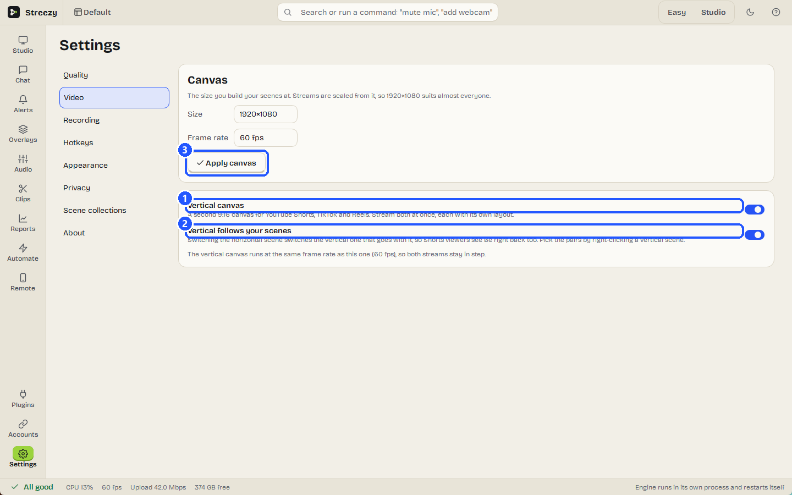

1. **Vertical canvas:** a second 9:16 canvas for YouTube Shorts, TikTok and Reels.
2. **Vertical follows your scenes:** when you switch your horizontal scene, the matching vertical scene switches too. Shorts viewers see *Be right back* when everyone else does.
3. Above them, **Size** and **Frame rate** set your main canvas. 1920×1080 at 60 fps suits almost everyone. Click **Apply canvas** after a change.

When you turn it on, Streezy builds a vertical version of each of your scenes.

### Work with both

1. **16:9 / 9:16** above the scenes switches between horizontal and vertical scenes.
2. **The vertical preview** shows what phone viewers see. Arrange things in it the same way as in the main preview.
3. **16:9 / 9:16** above the sources chooses which canvas's sources you are editing.

To put something you already have onto the vertical canvas, right-click it and choose **Also show in Vertical**.

**Sound** always comes from the horizontal canvas, and both streams use it.

### Pair vertical scenes

On the **9:16** tab, right-click a vertical scene and open **Switches with** (1). Pick the horizontal scene it goes with, or **Nothing, I switch it myself**.

### Stream it

Each destination's **Picture** setting decides which canvas it gets. TikTok and YouTube Shorts are vertical by default. In **Go live**, tick both kinds of destination and they start together.

---

# Part 5. More tools

## 18. Studio mode

Studio mode lets you get the next scene ready while viewers keep watching the current one.

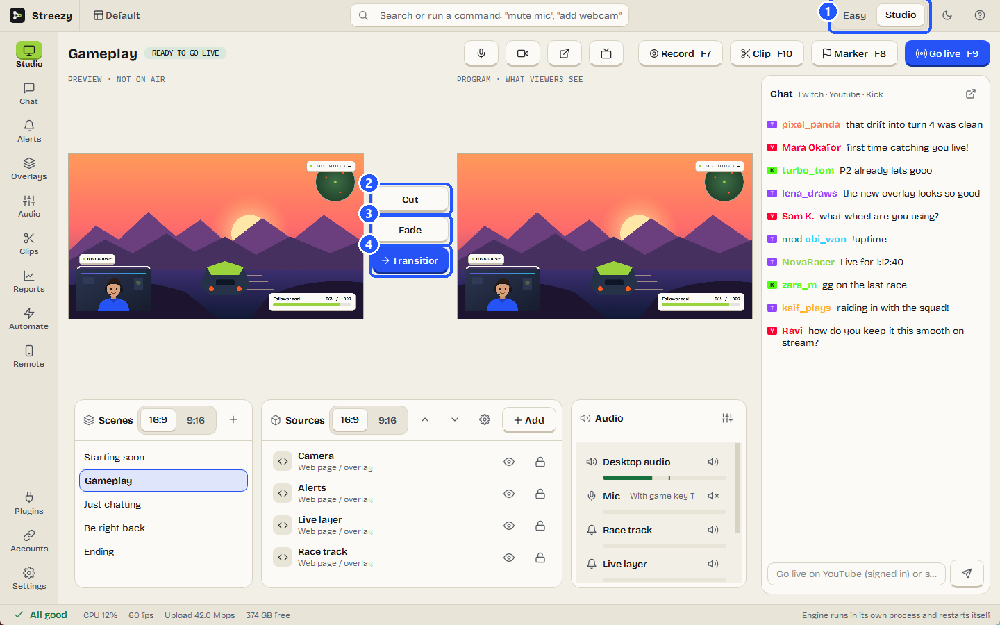

1. Switch the top bar to **Studio**.
2. Clicking a scene now loads it into the left side, **Preview · not on air**. Arrange it as you like. Then press **Cut** to switch instantly…
3. …**Fade** to cross-fade…
4. …or **Transition** for your chosen transition.

The right side, **Program**, is what viewers see. Switch back to **Easy** at any time. In Settings > Appearance you can choose which mode Streezy starts in.

## 19. Recording and clips

### Recording

Press **Record** (or **F7**) to record to your PC; press it again to stop. You can record without going live.

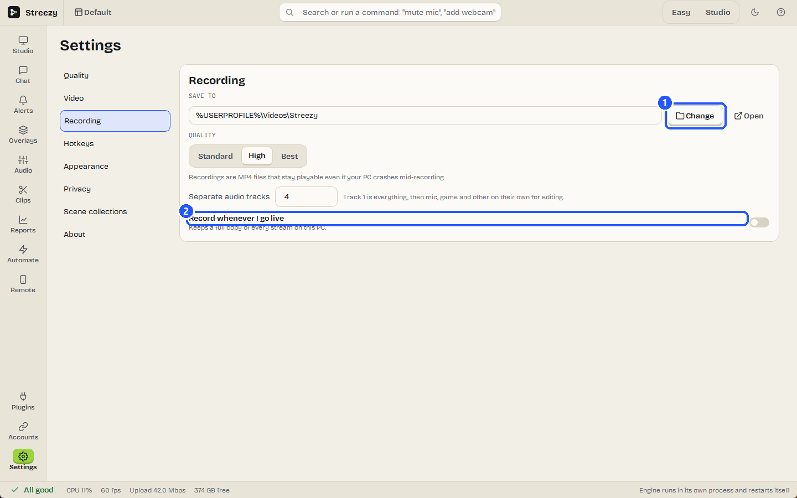

1. **Change** the folder recordings go to. By default it is `%USERPROFILE%\Videos\Streezy`.
2. **Record whenever I go live** keeps a full copy of every stream.

**Quality** is **Standard**, **High** or **Best**. Recordings are MP4 files that stay playable even if your PC crashes mid-recording.

**Separate audio tracks** records your mic, game and other sounds on their own tracks as well as the full mix, which is handy for editing.

### Clips

A clip saves **the last moments** of your stream (2 minutes by default) after something great happens.

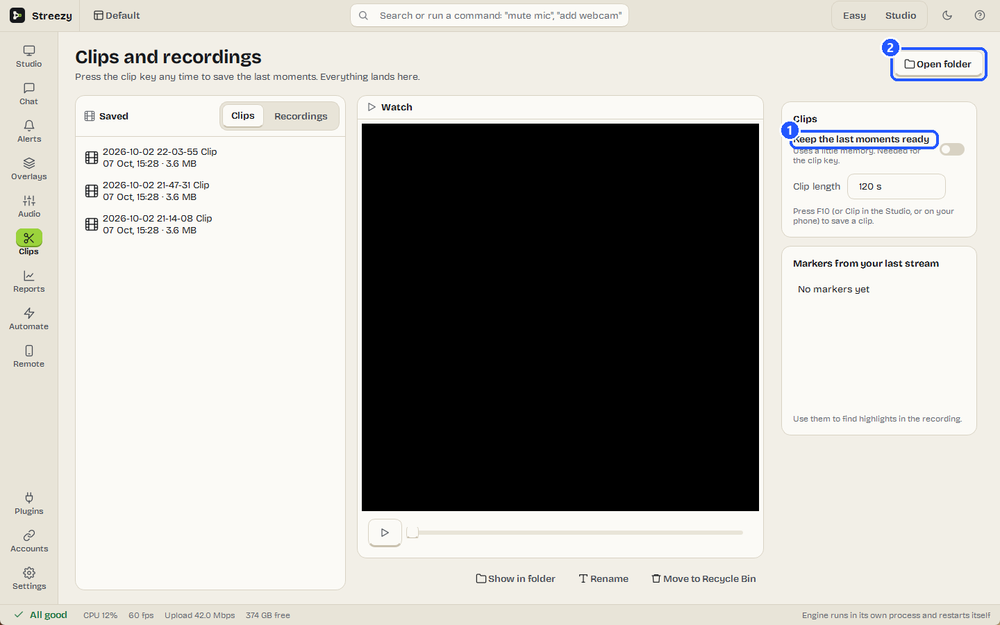

1. **Keep the last moments ready** must be on for clips (it is by default). **Clip length** sets how much is kept.
2. **Open folder** opens your clips folder. Clips go to the `Clips` folder inside your recordings folder.

Save a clip with **F10**, the **Clip** button, mini mode or your phone. On the left you can watch, **Rename**, **Show in folder** or **Move to Recycle Bin**, for both **Clips** and **Recordings**.

**Markers** (**F8**) note a time during a stream or recording. They appear in the report and on this page, so you can find highlights later.

## 20. Stream reports

After every stream Streezy writes a short report. Open **Reports** in the left rail.

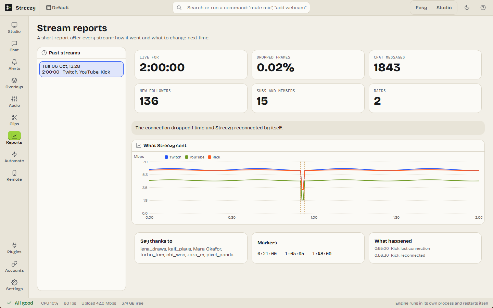

It shows:
- how long you were live
- dropped frames
- chat messages, new followers, subs and raids
- a chart of what Streezy sent to each platform
- markers, and who to thank
- **plain advice**, for example "Smooth stream: no dropped frames and no reconnects", or what to change next time

## 21. Automate

Let Streezy switch scenes for you. Open **Automate** in the left rail.

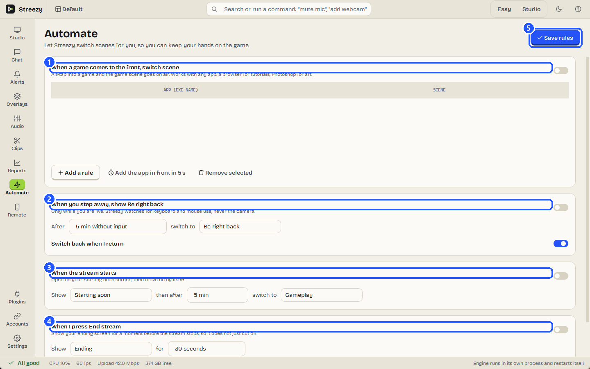

1. **When a game comes to the front, switch scene.** Alt-tab into your game and the game scene goes on air. Add a rule per app, or press **Add the app in front in 5 s** and click into the game.
2. **When you step away, show Be right back.** After a few minutes without keyboard or mouse input while live, Streezy switches to Be right back, and switches back when you return. It never uses your camera for this.
3. **When the stream starts:** open on your Starting soon screen, then move on to your main scene after a few minutes.
4. **When I press End stream:** show your Ending scene for a few seconds before the stream stops.
5. Click **Save rules**.

## 22. Phone remote and Stream Deck

Open **Remote** in the left rail.

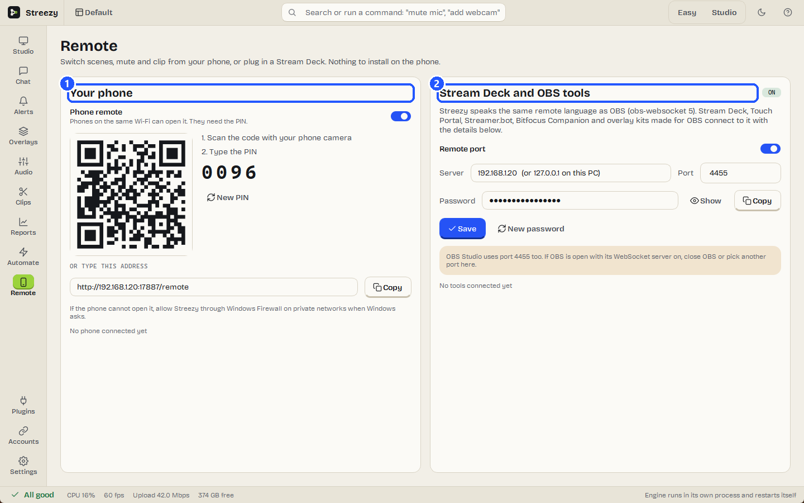

1. **Your phone.** With your phone on the same Wi-Fi as your PC:
   - scan the code with the phone's camera,
   - type the 4-digit PIN.

   Your phone can then switch scenes, mute your mic, save clips, add markers, start recording, go live, and read chat. Nothing to install. **New PIN** signs every phone out. If the phone can't open the page, allow Streezy through Windows Firewall on private networks.
2. **Stream Deck and OBS tools.** Streezy speaks the same remote language as OBS (obs-websocket 5). Stream Deck, Touch Portal, Streamer.bot, Bitfocus Companion and overlay kits made for OBS connect with the **Server**, **Port** (4455) and **Password** shown here.

> OBS Studio uses port 4455 too. If OBS is open with its WebSocket server on, close OBS or pick another port here, then click **Save**.

## 23. Plugins

Streezy runs on the OBS engine, so most OBS source and filter plugins work here too. Open **Plugins** in the left rail.

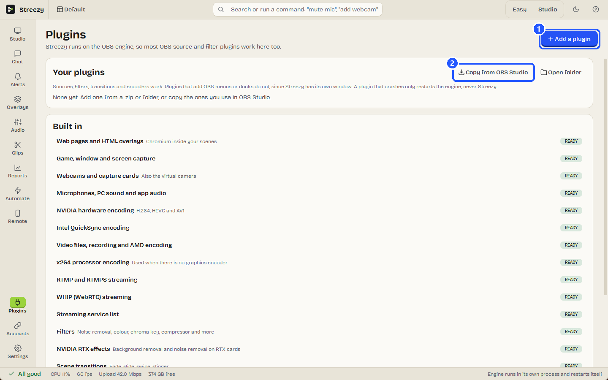

1. **Add a plugin:** download the plugin for Windows (64-bit) from its page, then choose the .zip file or the unzipped folder. Only add plugins from places you trust.
2. **Copy from OBS Studio:** brings over the plugins you already use in OBS.

Then click **Restart the engine to apply changes** (not while live or recording). Each plugin has a switch to turn it off. Plugins that add OBS menus or docks don't work, because Streezy has its own window. A plugin that crashes only restarts the engine, never Streezy itself.

## 24. Scene collections and moving from OBS

A **scene collection** is a full set of scenes, for example one per game or show. Switch between them with the button at the top left of the window.

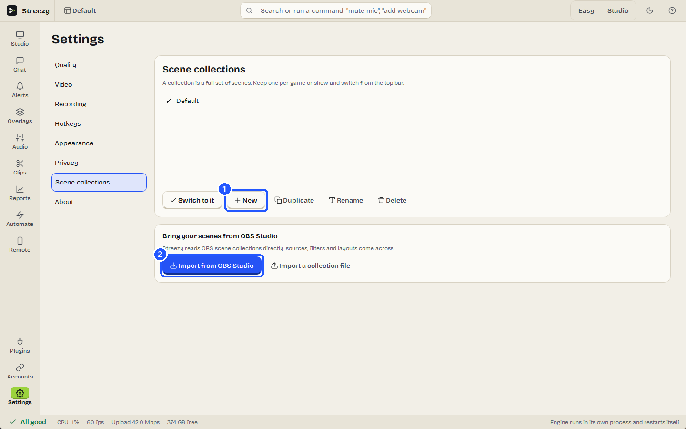

1. **New** makes a collection: empty, or with ready-made scenes for a kind of stream. You can also **Switch to it**, **Duplicate**, **Rename** or **Delete** one.
2. **Import from OBS Studio** brings your OBS scene collections across, with sources, filters and layouts. **Import a collection file** works with a `.json` file exported from OBS.

## 25. Hotkeys

Hotkeys work even while your game has focus, and the game still gets the key press. Change them in **Settings > Hotkeys**: click a box, press the new key, or press **Esc** to cancel.

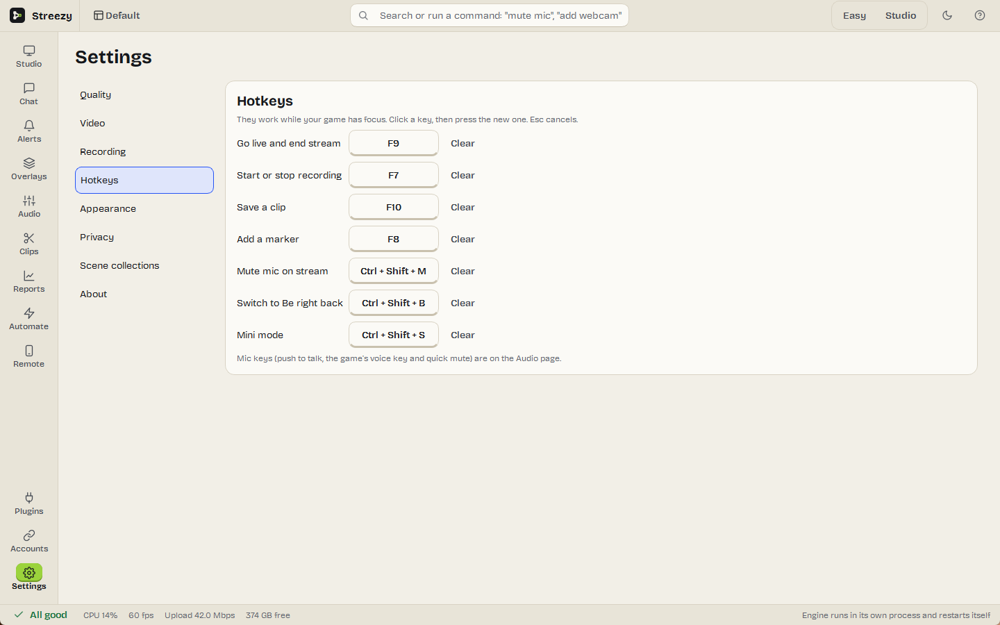

| What | Default key |
|---|---|
| Go live and end stream (press twice within 3 s to end) | **F9** |
| Start or stop recording | **F7** |
| Save a clip | **F10** |
| Add a marker | **F8** |
| Mute mic on stream | **Ctrl+Shift+M** |
| Switch to Be right back | **Ctrl+Shift+B** |
| Mini mode | **Ctrl+Shift+S** |
| Command palette (in Streezy only) | **Ctrl+K** |
| Settings (in Streezy only) | **Ctrl+,** |

Mic keys are on the **Audio** page: push to talk (**V**), your game's voice key (**T**) and quick mute (**Ctrl+Alt+M**).

## 26. Command palette, mini mode, projector and virtual camera

### Command palette

Press **Ctrl+K**, or click the search bar at the top, and type.

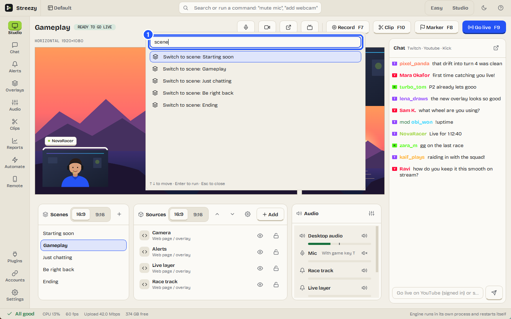

1. Type a scene name or a command, for example "scene", "mute", "add webcam" or "test alert". Use the arrow keys and **Enter** to run it.

### Mini mode

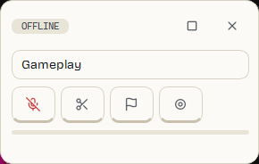

Mini mode (**Ctrl+Shift+S**, or the toolbar button) is a small window that floats over your game. It shows whether you are live, has a scene picker, buttons for mute, clip, marker and record, your mic level and the latest chat message. Drag it anywhere.

### Projector

The projector button on the toolbar shows your stream full screen on another monitor, horizontal or vertical. That is useful for a second screen or a capture setup. Press **Esc** on it to close it.

### Virtual camera

Streezy can appear as a webcam in Zoom, Google Meet or Discord. Press **Ctrl+K** and run **Start virtual camera**, then pick "OBS Virtual Camera" in the other app. **Stop virtual camera** turns it off.

## 27. Other settings

### Appearance

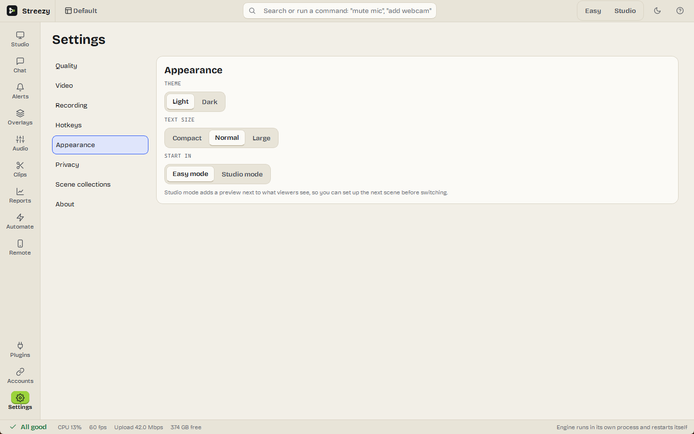

- **Theme:** Light or Dark. The moon icon at the top switches it too.
- **Text size:** Compact, Normal or Large.
- **Start in:** Easy mode or Studio mode.

### Privacy

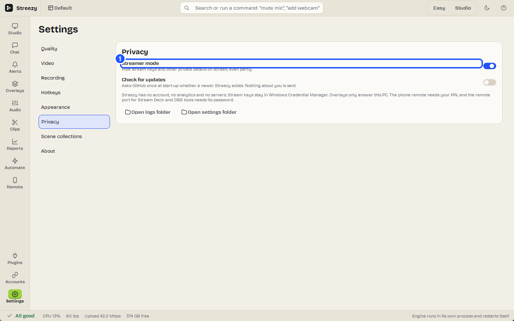

1. **Streamer mode** (on by default) hides stream keys and other private details on screen, even partly. Keep it on while you stream.

**Check for updates** asks once at start-up whether a newer Streezy exists; nothing about you is sent. **Open logs folder** and **Open settings folder** are here too.

### About

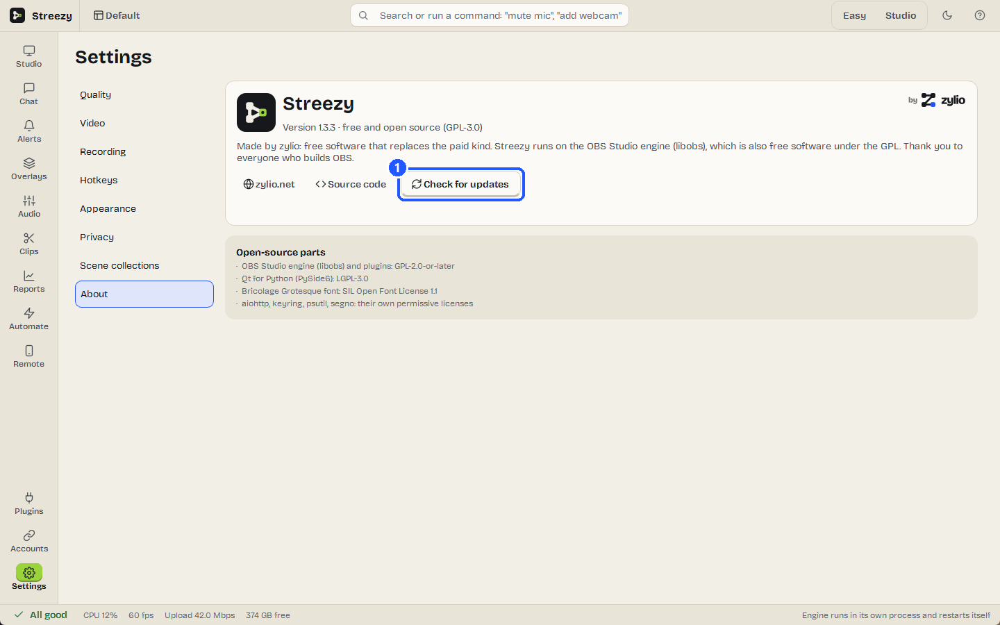

1. **Check for updates.** You can also open zylio.net or the source code from here.

---

# Part 6. Help

## 28. The stream doctor

Click the status bar at the bottom (**All good**) or the **?** at the top right.

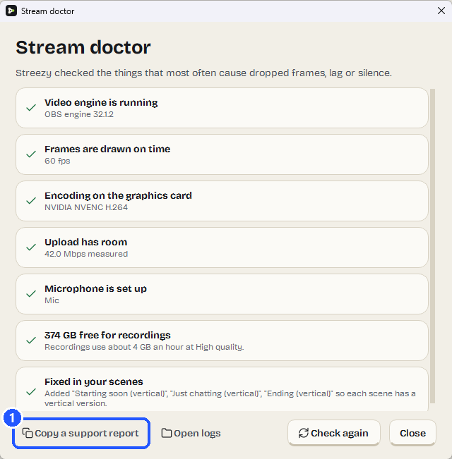

The doctor checks the things that most often cause dropped frames, lag or silence:
- the video engine
- frames
- the encoder
- your upload
- your mic
- game capture
- disk space
- chat sign-ins
- sound playing twice
- plugins

Each problem comes with a button that fixes it or takes you to the right place.

1. **Copy a support report** copies a summary to send when asking for help. It never contains stream keys or passwords.

## 29. If something goes wrong

| Problem | What to do |
|---|---|
| **The game shows black or nothing** | Start the game first; the source says *waiting for the game* until then. Run the game in borderless or full screen, or use **Window** capture instead. Some anti-cheat games block capture. |
| **Viewers can't hear me** | Check the mic mode on the Audio page. With **Push to talk** or **With my game's talk key**, viewers only hear you while you hold the key. Check the mic button isn't muted (it turns red). |
| **Viewers hear my Discord** | On the Audio page set PC sound to **Only my game**, and the mic to **With my game's talk key** or **Push to talk**. |
| **Something is heard twice** | PC sound is set to **Everything** and you also added that app. Set PC sound to **Only my game**, or remove the extra source. |
| **The stream stutters or drops frames** | Choose a lighter preset in Settings > Quality, run the check again, or untick a destination. If the game itself stutters, turn on **Low-end mode**. |
| **"No stream key saved"** | Add the key in **Accounts** (gear icon to edit). |
| **"Use the same stream key"** | Two destinations have the same key. Each needs its own. For YouTube plus Shorts, make a second key in YouTube Studio. |
| **YouTube shows nothing** | Wait 10 to 20 seconds after going live. Check live streaming is turned on for your channel in YouTube Studio. If you signed in, try signing out and in again in Accounts. |
| **YouTube chat doesn't show** | It appears once you are live on YouTube. Check your channel in Chat > Connections. |
| **Overlays are blank** | Another program may be using Streezy's overlay port. The stream doctor says so; close that program and restart Streezy. |
| **The phone remote won't open** | The phone must be on the same Wi-Fi. Allow Streezy through Windows Firewall on private networks. |
| **Stream Deck can't connect** | OBS may be open on port 4455. Close OBS or change the port on the Remote page. |
| **The engine keeps restarting** | Open the stream doctor. A plugin you added may be crashing it; turn it off in Plugins. |

### When Streezy restarts things by itself

- **The video engine runs separately from the window.** If a plugin, capture or overlay crashes it, Streezy restarts it within seconds, brings back your scenes, and reconnects your stream and recording. A message explains what happened.
- **Safe mode:** if the engine stops more than once, Streezy pauses the plugins you added. The doctor offers **Leave safe mode** when you are ready.
- **Overlays without the graphics card:** if a web overlay crashed the graphics part of the engine, overlays switch to drawing on the processor. The doctor offers **Use the graphics card again**.
- **Safe start:** if Streezy didn't close properly last time, it asks whether to **Start normally** or **Safe start** (without your scenes and plugins). Your scenes stay saved either way. Load them later from the stream doctor with **Load my scenes**.

## 30. Updating and uninstalling

- **Updating:** when a new version is out, Streezy shows *Update available* a few seconds after it starts. Click **Install now**. Streezy checks the download is genuine, installs it, and opens again. If you are live, it waits until you finish. You can also check in **Settings > About**.
- **Uninstalling:** use **Windows Settings > Apps > Streezy > Uninstall**. Your settings, scenes and recordings are kept, in case you come back. Delete `%APPDATA%\Streezy` and `%USERPROFILE%\Videos\Streezy` yourself if you want them gone.

## 31. Privacy and where your files are

- **No account, no analytics, no tracking.** Streezy doesn't send anything about you anywhere.
- **Stream keys and sign-ins** are kept in Windows Credential Manager on your PC, never in a file, and never sent to zylio.
- **Overlays** only answer your own PC. The **phone remote** needs your PIN, and the **remote port** for Stream Deck and OBS tools needs its password.
- **Reading chat** connects straight to Twitch, YouTube and Kick, the way their websites do.

| What | Where |
|---|---|
| Settings, scenes, reports, logs, plugins, overlay kits | `%APPDATA%\Streezy` |
| Recordings | `%USERPROFILE%\Videos\Streezy` |
| Clips | `%USERPROFILE%\Videos\Streezy\Clips` |
| The app itself | `C:\Program Files\Streezy` |

Read the full privacy policy at [zylio.net/privacy](https://zylio.net/privacy#streezy).

## 32. Words you will see

| Word | Meaning |
|---|---|
| **Scene** | One screen layout, for example *Gameplay* or *Be right back*. |
| **Source** | One thing inside a scene: your game, camera, an image, an overlay. |
| **Overlay** | Graphics on top of your stream, such as a name tag, alerts or a countdown. |
| **Canvas** | The picture you build scenes on. Horizontal is 16:9; vertical is 9:16. |
| **Destination** | A place you stream to, such as Twitch, YouTube or Kick. |
| **Stream key** | A secret code from the platform that lets an app stream to your channel. |
| **Bitrate (Mbps)** | How much data your stream sends each second. Higher looks sharper but needs more upload. |
| **Upload speed** | How fast your internet can send data. Streaming depends on upload, not download. |
| **Encoder** | The part that compresses your video. A graphics-card encoder (NVIDIA, AMD, Intel) leaves your processor free. |
| **Dropped frames** | Frames that didn't reach the platform because the upload couldn't keep up. |
| **Push to talk** | Viewers hear your mic only while you hold a key. |
| **Clip** | A short video of the last moments, saved with one key. |
| **Marker** | A note of a moment, to find it later in the recording. |

## 33. Get help

- **Email:** [support@zylio.net](mailto:support@zylio.net). Paste the **support report** from the stream doctor so we can help faster.
- **Website:** [zylio.net/software/streezy](https://zylio.net/software/streezy)
- **Downloads and what's new:** [the releases page](https://github.com/faisalrasheed442/streezy-releases/releases)

Streezy is free and stays free. It is made by zylio and built on OBS Studio's engine. Thank you to everyone who builds OBS.
